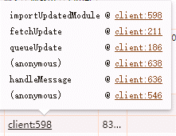

## 需求描述

我希望写文章时能在**页面**中直接预览效果。

原本我没有这个打算，以为用 vscode 就足够了。在 vscode 中写 md 时有语法高亮，想看完整效果就用它自带的预览功能。但是真的写文章时我发现不太 ok，原因如下：

- 正如我在[《个人博客网站开发记录》](post:fa43201f-1e9e-411d-abc6-2d9e1411c13c)的《难点：md 语法的“灵活”》一节提到：vscode 和 showndown 的语法规则不一致。比如 `a_b_c`，vscode 中会把 b 两侧的下划线识别为普通文本，但是 showndown 会把它们识别成斜体的标志。这类不一致的表现我希望在写文章时能第一时间发现。

- 对相同的元素 vscode 和页面中的样式也不一样，比如 heading 的颜色、字号。我希望文章在**页面**中的排版是好看的。

###### Before - 手动生成数据

我之前写了一个脚本 `generate-data-once`，根据文章信息生成 `/build-static-html/data/posts.js` 文件。

App.vue 引用此文件获取数据：

```js
import { posts } from "../data/posts.js";
```

generate-data-once 是一次性操作：每次文章有变化，都要手动执行这个脚本生成新数据。

很麻烦，我需要把它改成自动的。

###### After - 监听变化，自动生成数据

watch 所有文章，一旦发现变化就重新生成数据。因为数据文件 data/posts.js 在 vite 项目中，所以它一变化，vite 就会热刷新。

思路没问题，下面开始实践。新开一个项目测试，成功了再挪到博客项目中。

## 监听变化，自动生成数据

新建 demo 项目测试，目录结构：

- web-application（vite 项目）
  - data/message.js
  - src/App.vue
- generate-data.js
- source.txt

generate-data.js：

```js
const sourcePath = path.join(process.cwd(), "source.txt");
const outputPath = path.join(process.cwd(), "web-application/data/message.js");

generateFile();
watch(sourcePath, async (eventType, filename) => {
  console.log(`检测到 ${filename} 文件 ${eventType}！`);
  generateFile();
});

async function generateFile() {
  const content = await readFile(sourcePath, { encoding: "utf-8" });
  await writeFile(outputPath, `export const message = ${JSON.stringify(content)};`);
}
```

web-application/src/App.vue 引用 message：

```js
import { message } from "../data/message.js";
```

package.json 添加两条命令：

```js
  "scripts": {
    "generate-data": "node generate-data.js",
    "serve": "cd web-application && npm run dev",
  },
```

测试效果：开两个 cmd，分别执行 `npm run generate-data` 和 `npm run serve`。每次修改 source.txt，页面都会自动刷新显示新内容。成功~！

## 将两个命令合为一个

已经实现自动生成数据了，但是需要开两个 cmd，敲两个命令，麻烦麻烦。我要把它们合为一个。

在网上查到 npm scripts 中可以用 && 或 & 连接多条命令，&& 是串行执行，& 是并行。

在 package.json 添加新命令：

```js
   "easy-run": "npm run generate-data & npm run serve"
```

测试效果，执行 `npm run easy-run`，失败！ 只执行了 `generate-data`，没有执行 `serve`。

经过我多次调试，我发现 & 在这里就是串行的效果。前一个命令执行完才会执行下一个，因为 generate-data 里有 watch，它不会执行完，所以 serve 永远不会执行。

如果把两个子命令颠倒顺序 `npm run serve & npm run generate-data`，就变成只执行 serve 了。

又在网上查了很久，最后发现有一个大神提到 **& 是并行** 这个规则 **windows** 系统并不支持，效果和 && 一样仍然是串行。

<p style="color:#ff5722">环境的兼容性问题真的好坑啊！网上很多文档、资料、讨论都忽视 windows 操作系统，在你自己测试踩坑前你不知道哪个命令、哪个运算符 windows 不支持。<br>如果只是不支持还好点，直接报错，能第一时间发现问题。如果是像我遇到的这个情况，它也不会报错，只是行为不一致。你不知道你写的一大串代码和命令到底哪里出的问题，很让人抓狂。</p>

（兼容性问题真的蛮多的，再举一个例子：[nodejs --watch-path](https://nodejs.cn/api-v16/cli/watch_path.html)）

言归正传，没办法用 & 实现并行了。自己写一个脚本实现并行：利用 node 的 child_process 模块

```js
// all-in-one.js
import child_process from "node:child_process";

createChildProcess("npm run generate-data");
createChildProcess("npm run serve");

// 创建子进程，并将子进程的 output 输出到主进程
function createChildProcess(cmdstr) {
  const child = child_process.exec(cmdstr);

  child.stdout.setEncoding("utf8");
  child.stdout.on("data", function (data) {
    console.log(data);
  });

  child.stderr.setEncoding("utf8");
  child.stderr.on("data", function (data) {
    console.log("stderr: " + data);
  });

  child.on("close", function (code) {
    console.log("关闭子进程 " + code);
  });
  return child;
}
```

测试效果：执行 `node all-in-one.js`。两个子进程都成功开启了，每次修改 source.txt，页面都会看到新内容。成功~！

## 在博客项目中实践失败

在 demo 项目中测试成功后，我把功能移植到博客项目里。但是运行却失败了！

在博客项目中，每次修改文章后可以成功修改 data/posts.js 的内容，但是 vite 的热刷新会报错：

`SyntaxError: The requested module '/data/posts.js?t=[timestamp]' does not provide an export named 'posts' (at App.vue)`

`[hmr] Failed to reload /src/App.vue. This could be due to syntax errors or importing non-existent modules.`

我猜测原因可能是：writeFile 不是 atomic 的。在 demo 项目中数据量少，一次写入成功。但是博客项目 posts 数据量很大，nodejs 内部可能是把它分段写入的。
每次分块写入完，文件变化被 vite 开发服务器监听到。vite 触发热更新，但这时候文件还是"半成品"，所以报错了（这一大段都是我自己的推测，并不保真）

我又回到 demo 项目中测试，把写入的内容修改为 source 内容重复 1000000 次：

```js
// generate-data.js
async function generateFile() {
  const content = ...
  await writeFile(outputPath, `export const message = ${JSON.stringify(content.repeat(1000000))};`);
}
```

在 demo 项目中再次测试效果：执行 `node all-in-one.js`，果然和博客项目出现同样的错误了！

看来问题果然出在 writeFile 内容过多！

<span style="background:#eee">插播：后来我又找到一个包 [write-file-atomic](https://www.npmjs.com/package/write-file-atomic)，它能保证写入时的原子性。我用它测了一下，确实不会报错了。我不打算改方案，只是在这里提一下还有这个方法。</span>

## 自动重启 vite

我想到一个思路解决上面的问题：每次监听到文章变化后，重启 vite 服务。

这需要子进程 generate-file 能和父进程通信。

### 父子进程通信

我查到了 nodejs 的父子进程可以通过 `send` 和 `on("message",handler)` 通信。在子进程中发送信息：

```js
//  generate-data.js
watch(sourcePath, async (eventType, filename) => {
  console.log(`检测到 ${filename} 文件 ${eventType}！`);
  process.send("SOURCE_CHANGE");
  generateFile();
});
```

在父进程接收信息：

```js
// all-in-one.js
const dataProcess = createChildProcess("npm run generate-data");
const serveProcess = createChildProcess("npm run serve");

dataProcess.on("message", function (message) {
  console.log("收到信息", message);
});
```

测试效果，执行 `node all-in-one.js`，子进程报错：`process.send is not a function`。

研究了一下发现，父子进程想要通信必须使用 `child_process.fork` 创建子进程。

> The child_process.fork() method is a special case of child_process.spawn() used specifically to spawn new Node.js processes. Like child_process.spawn(), a ChildProcess object is returned. The returned ChildProcess will have an additional communication channel built-in that allows messages to be passed back and forth between the parent and child.

我上面使用 `child_process.exec` 创建的 generate-data 子进程无法和主进程通信，此时子进程里的 process.send 是 undefined。

exec 和 fork 区别蛮大的：exec 接受命令字符串，fork 接收文件路径。

修改主进程文件 all-in-one.js：

```js
// const dataProcess = createChildProcess("npm run generate-data");
const dataProcess = child_process.fork("./generate-data.js");
```

测试效果，执行 `node all-in-one.js`，父子进程成功通信！

把 generate-data.js 也完善一下，这样即使直接调用此文件也不会报错（直接调用此文件时，process.send 也是 undefined）：

```js
watch(sourcePath, async (eventType, filename) => {
  if (process.send) {
    process.send("SOURCE_CHANGE");
  }
  // process.send("SOURCE_CHANGE");
});
```

### 重启 vite 子进程

收到消息后 先 kill 再重新建一个 vite 子进程：

```js
// all-in-one.js
const dataProcess = child_process.fork("./generate-data.js");
let serveProcess = createChildProcess("npm run serve");

dataProcess.on("message", function (message) {
  console.log("收到信息", message);
  serveProcess.kill();
  serveProcess = createChildProcess("npm run serve");
});
```

测试效果，执行 `node all-in-one.js`，出错，效果很奇怪：每次文章有变化，主进程收到信息关闭 vite 子进程。输出显示子进程已经被关闭。然后重新启动一个 serve 子进程。但是提示 `Port 5173 is in use, trying another one...`。多次修改文章，不断 kill、新建，出现多个 serve 子进程，端口不断顺延：5173 5174 5175 5176...

起初我以为是前一个 vite 子进程还没有完全关闭，导致下一个启动时端口还在被占用。但是我调试发现，所有这些 vite 服务都在，在浏览器中访问所有 port 的网址，页面都在好好的运行。说明它们都没有被 kill 掉！！！！！

在网上查了很久也没有明确的答复，不少人遇到这个问题，但都没有确切原因和解决方案。我只能大概推测：windowns 系统中执行 `child_process.exec` 时开启了一个 shell，kill 的时候关闭的是 shell，但是里面的进程还在运行（我也不太懂）。反正又是操作系统的差异问题，反正就是我的 windows 电脑 kill 不掉它！

资料：[Cannot kill child processes](https://github.com/nodejs/node/issues/7281)

最终使用 [Why can I not kill my child process in nodejs on windows?](https://stackoverflow.com/questions/23706055/why-can-i-not-kill-my-child-process-in-nodejs-on-windows) 回答中推荐的 [tree-kill](https://www.npmjs.com/package/tree-kill) 包：

```js
dataProcess.on("message", function (message) {
  console.log("收到信息", message);
  // serveProcess.kill();
  kill(serveProcess.pid); // 改用 tree-kill 包的 kill 方法
  serveProcess = createChildProcess("npm run serve");
});
```

测试效果，执行 `node all-in-one.js`，成功！每次 source 变化后，vite 都会成功重启，端口不变一直是 5173。

## 不重启 vite 了，改为热更新

上面已经完成预期效果了，但我觉得重启服务器比较浪费性能。我要研究一下能不能让 vite 热刷新

### hmr 原理

vite 的 开发服务器通过 web-socket 和浏览器建立通信。dev-server 监听源文件变化，并将变化通知给浏览器，浏览器接收到变化的内容，应用到页面中。

修改 web-application/src/style.css 的内容，查看浏览器 network 面板，能看到接收到新的 css 文件：


查看 initiator：



查看 initiator 的源头，能看到是 web-socket 接收信息，打断点查看具体信息：


web-socket 接收到的信息内容：

```js
{
    "type": "update",
    "updates": [
        {
            "type": "js-update",
            "timestamp": 1722565462188,
            "path": "/src/style.css",
            "acceptedPath": "/src/style.css",
            "explicitImportRequired": false,
            "isWithinCircularImport": false,
            "ssrInvalidates": []
        }
    ]
}
```

### 手动触发 hmr

在 vite 源码中努力翻找，最终被我找到了 reloadModule 方法。在官方文档中也查到了这个 [API](https://v3.vitejs.dev/guide/api-javascript.html#vitedevserver)

```js
  /**
   * Triggers HMR for a module in the module graph. You can use the `server.moduleGraph`
   * API to retrieve the module to be reloaded. If `hmr` is false, this is a no-op.
   */
  reloadModule(module: ModuleNode): Promise<void>
```

调用 `viteDevServer.reloadModule()` 就可以手动触发 hmr 了。

如何拿到 viteDevServer 对象是一个问题。不能再用 vite 提供的现成命令了，想获取 viteDevServer 只能自己写脚本创建 vite 服务器了：

又是一通看源码，找到创建 server 的办法: [createServer](https://cn.vitejs.dev/guide/api-javascript.html#createserver)

遇到不少问题，过程不细说了，看[源码](https://github.com/liuzx-emily/blog/tree/main/scripts/super-dev)吧。只说几个关键点

###### triggerReload

```js
export function triggerReload(server, fullReload, path) {
  if (fullReload) {
    server.ws.send({
      type: "full-reload",
      path: "*",
    });
    return;
  }
  let filePath = _getPath(path);
  // filePath 中的目录分隔符是 \\ ，要转成 / 才能和 modulelGraph 中的匹配上。
  filePath = filePath.replaceAll("\\", "/");
  // moduleGraph 包含请求过的模块。没有在浏览器中访问过的模块不在 moduleGraph 中。如果根本没打开过浏览器，则 moduleGraph 为空。
  const moduleSet = server.moduleGraph.getModulesByFile(filePath);
  // 如果没有访问过该模块，moduleSet 为 undefined。
  if (moduleSet) {
    moduleSet.forEach((module) => server.reloadModule(module));
  }
```

###### debounce

debounce 是为了优化性能，但也是不得已而为之：用 vscode 修改 post.md 时，每次保存都会连续触发两次 watchListener，原因未明。

起先怀疑是因为 vscode 的 format on save，但是关闭了 format on save 和 eslint fix on save 后，保存还是会触发两次。用 txt 修改 post.md 时，保存只会触发一次。

连续触发的第二次 listener 必定报错：fs.cp 目标文件不存在。不知道为什么会报这个错误，推测和文件被占用有关。

```js
const postsChangeHandler = debounce(async () => {
  await generateDataPosts({ includeDrafts: true });
  triggerReload(server, false, "build-static-html/data/posts.js");
}, 1000);
```

###### full-reload

assets 放在 public 中，需要 full-reload

```js
const assetsChangeHandler = debounce(async () => {
  await gererateAssets();
  triggerReload(server, true); // 第二个参数是 fullReload
}, 1000);
```

---

总结一下遇到的有关 windows 的问题：

1. & 也是串行执行命令
2. `child_process.exec` 创建的子进程 kill 不掉。
