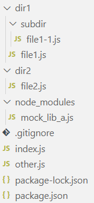
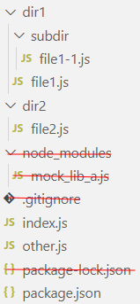
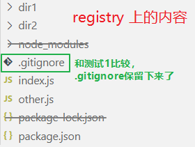
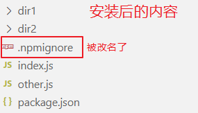
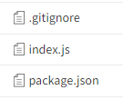
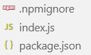

## 发布一个最简单的包

新建文件夹 lib-a，初始化 `npm init -y`

新建 index.js：

```js
const str = "hello";
module.exports = { str };
```

发布 package 时，package.json 中的 name 和 version 字段是必需的。name 是包的名称，version 是当前发布的版本。name 和 version 一起形成一个唯一的 identifier。

```js
  name: "lilytest-lib-a",
  version: "1.0.0",
```

发布

```bash
npm publish
```

### version

对 package 的任何改动都应该伴随着对 version 的改动。可以手动修改或者使用 [npm version](https://docs.npmjs.com/cli/v7/commands/npm-version)。

`npm version` 会修改 package.json、package-lock.json 和 npm-shrinkwrap.json 中的 version 值。

```bash
npm version [<newversion> | major | minor | patch]
```

初版本是 1.0.0，之后按照如下规则修改版本：

| Stage         |                                  | Rule           |
| ------------- | -------------------------------- | -------------- |
| Patch release | Backward compatible bug fixes    | 1.0.0 -> 1.0.1 |
| Minor release | Backward compatible new features | 1.0.1 -> 1.1.0 |
| Major release | Breaking changes                 | 1.2.0 -> 2.0.0 |

注意：在含有 git 的项目中执行 `npm version patch` 时，会自动创建一个 git commit 和 git tag。此行为可以使用 `--no-git-tag-version` 禁止：

```bash
# 不会创建 git commit 和 tag 了
npm version patch --no-git-tag-version
```

###### lock 文件中的 version

三个包管理器的 lock 文件中，只有 `package-lock.json` 中存了当前包的 version（不知道存这个有啥意义），`yarn.lock` 和 `pnpm-lock.yaml` 中都不存当前包的 version。

如果升级版本时是通过手动修改的：

- 使用 pnpm 或者 yarn 的项目都不需要再去 lock 文件中修改版本了
- 使用 npm 的项目需要修改 lock 文件的版本：执行 `npm i` 重新生成 lock 文件，这会更新 lock 中的 version 版本

### dist-tag

```bash
npm dist-tag add <package-spec (with version)> [<tag>]
npm dist-tag rm <package-spec> <tag>
npm dist-tag ls [<package-spec>]
```

```bash
# 发布时指定标签
npm publish --tag <tag>
# 如果发布时未指定标签，则 npm 使用 latest 作为此版本的标签（此行为是强制的）
npm publish
```

latest 标签是 npm 中唯一有特殊语义的标签：安装 package 的时候，如果没有指定 version 和 tag，那么会安装 latest 对应的版本。

- [Adding dist-tags to packages](https://docs.npmjs.com/adding-dist-tags-to-packages)
- [npm dist-tag](https://docs.npmjs.com/cli/v10/commands/npm-dist-tag)
- [npm publish --no-tag publishes with "false" dist-tag](https://github.com/npm/npm/issues/10625)

<span style="color:darkorange;">我测试 dist-tag 时遇到 bug：已移除的 tag 在下一次发布新版本之后会重新出现。此 bug 可稳定复现，我用的 npm 版本是 10.8.1（node@22.3.0），win10 系统。</span>

## publish with provenance

使用自动化工具 publish package，可以设置 provenance。具体看 [《github workflow：publish npm package with provenance》](post:13b80421-c3ec-4c43-89d8-6dee8fb2b71a)

## 小心！发布时不是原样上传！

在 npm 发布 package 时，可以使用 **packge.json 的 files 字段(白名单)** 和 **.npmignore 文件(黑名单)** 告诉 npm 你想包含哪些文件。但是你的决定权是**有限**的，有一部分内容是 npm 强制包含或排除的，无论你怎么设置都无法改变。

如果说上述行为算是可以理解的，那么下面的操作就让人难以接受了：在别人使用 npm install 安装你发布的包时，npm 会修改你包中的文件！——说的就是 `.gitignore` ，npm 会把它自动重命名为 `.npmignore`。

这对普通项目可能影响不大，但是对于 generator 就影响很大了（比如我写的 [lily-cli 脚手架](post:1ac6fb5e-1737-44a7-881e-31a35ba69e33)）。这一自动重命名的行为是强制的，你无法通过任何设置取消。

generator 中 .gitignore 问题的解决方案：generator/template 中的 .gitignore 改名为 gitignore，在构建时自动改回来

### npm 强制行为

将 package 发布到 npm public registry 时，npm 强制包含/排除的内容：

#### 发布时强制包含

- package.json
- README（大小写任意，后缀任意）
- LICENSE / LICENCE（大小写任意，后缀任意）
- The file in the "main" field
- The file(s) in the "bin" field

#### 发布时强制排除

- .git
- .npmrc
- node_modules
- lock 文件：package-lock.json、pnpm-lock.yaml、yarn.lock

#### 安装时强制改名

在别人安装你的包时，如果包含 .gitignore 文件，npm 会强制重命名为 .npmignore

### package.json 的 files 字段

白名单。

默认为`["*"]`，即包括所有内容（官方文档是这么写的，但是经我实际测试不设置 files 字段和设置 `files:["*"]` 的行为是不同的。见下面的测试 2）

### .npmignore 文件

黑名单。

如果没有 `.npmignore` 文件，但有 `.gitignore` 文件，那么 npm 将使用 .gitignore 文件的规则。如果想要包含 .gitignore 文件中排除的内容，可以创建一个空的 .npmignore 文件来覆盖它。与 git 一样， npm 在包的所有子目录中查找 .npmignore 和 .gitignore 文件，而不仅仅是根目录。

以下内容是 npm 默认忽略的，不需要在 .npmignore 文件中设置。如果想要包含这些内容，可以在 files 字段中设置：

- .\*.swp
- .\_\*
- .DS_Store
- .gitignore（很特殊！可以发布到 registry 上，但是安装到本地后会被重命名为 .npmignore)
- .hg
- .npmignore
- .lock-wscript
- .svn
- .wafpickle-\*
- config.gypi
- CVS
- npm-debug.log

（注：名单可能不全。我是在 npm 官方文档里找到的这个名单。官网里有两篇内容里都出现了这个名单，但内容不一致，所以完整性存疑。）

参考文档：

- [files](https://docs.npmjs.com/cli/v10/configuring-npm/package-json#files)
- [Keeping files out of your Package](https://docs.npmjs.com/cli/v10/using-npm/developers#keeping-files-out-of-your-package)

### 测试

#### 测试 1：未设置 files 字段

本地结构：



发布之后，在 npm registry 看到的内容。并且也是使用 npm install 安装到本地的内容：



发布后的内容中不包含 `node_modules`、`.gitignore` 和 `package-lock.json`

#### 测试 2：设置 `files: ["*"]`

在 package.json 中添加 `files: ["*"]`

发布后在 npm registry 上查看内容。和测试 1 的结果比较，多了 .gitignore 文件：



这说明不设置 files 字段与设置 ` "files": ["*"]` 的行为并不是完全一致的。（.gitignore 文件的不同效果是我无意中测试出来的，至于其他还有哪些文件受影响我也不知道，没有在官方文档中找到相关说明）

在其他项目中使用 `npm install` 安装这个包，可以看到安装后 .gitignore 被自动改名为 .npmignore 了：



#### 测试 3：修改 files

在测试 1 中有三个文件（夹）被排除了。
假设有一个萌萌开发者，想把这三个文件也包含进来，他修改 files 字段：

```json
  "files": [
    "node_modules/",
    ".gitignore",
    "package-lock.json"
  ],
```

发布后在 npm registry 上查看：



只留下了三个文件！

因为在未设置 files 时默认包含所有文件。一旦设置了 files 字段，那么将只包含你设置的内容了！更明确一点，是 **npm 强制包含的内容** + **在 files 字段设置了且不是被 npm 强制排除的内容**。具体在这个例子中：

- npm 强制包含的内容
  - package.json
  - index.js（因为我在 package.json 中设置了`"main": "./index.js"`，如果没有设置那么 index.js 也留不下来）
- 在 files 字段设置了且不是被 npm 强制排除的内容
  - .gitignore

files 字段中设置的 `node_modules` 和 `package-lock.json` 都是被 npm 强制排除的，所以设置也无效。

在其他项目中安装这个包：.gitignore 依然被重命名为 .npmignore 了



### 利用 npm pack 测试

研究这个问题还是挺麻烦的。需要一遍遍的修改本地文件，发布，再去 npm registry 上查看，再去另一个项目中安装。

幸好我在查资料的时候发现 `npm publish` 和 `npm pack` 在这个问题上总是被一起讨论。`npm pack` 是打压缩包，看了下源码发现 publish 和 pack 都是调用相同的内部方法。所以可以用 pack 替代 publish 进行测试！这就方便许多了。

执行 `npm pack`，得到一个 .tgz 压缩包，解压后就可以看到所有内容了：


注意：pack 模拟的是发布到 npm registry 的内容，而别人下载后看到的内容无法通过 pack 模拟得知。所以你在上图看到的是 .gitignore，而不是 .npmignore

---

参考资料：

- npm 文档：[Keeping files out of your package](https://docs.npmjs.com/cli/v6/using-npm/developers#keeping-files-out-of-your-package)
- npm 文档：[package.json - files](https://docs.npmjs.com/cli/v10/configuring-npm/package-json#files)
- issues opened by npm founder：[Rename .gitignore to .npmignore in package if no .npmignore found](https://github.com/npm/npm/issues/1862)
