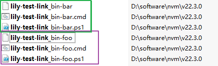

开发 package 时使用 npm link 本地测试非常方便。

称开发的 package 为 a，用来测试 a 的项目叫 b。链接 a 和 b 有两个步骤：

1. 将 a 链接到全局
2. 将 global-symlink-a 链接到 b

链接好后，可以在全局环境 or 项目 b 中使用包。

- 全局环境：在完成第一步后已经可以使用。npx 调用 a 的 bin
- 项目 b：普通引用或者 npx 调用 a 的 bin

解除链接：

- 全局环境：`npm uninstall -g a`
- 项目 b：`npm uninstall a`

## 建立链接

### 项目结构

###### 项目 a

假设正在开发名为 lily-test-link 的 package（简称为 a），存放在项目 project-a 中。项目包含四个文件：

小技巧：<span style="color:darkorange;">npm 文档中的描述并不一定符合你实际运行的情况（可能是操作系统区别导致，或者仅仅是文档没有更新），可能在文档说明的位置找不到对应文件。所以在测试时将各种名称取得比较独特，这样可以通过 Everything.exe 等检索工具方便地找到文件，不至于抓瞎。</span>

```js
// package.json
{
  "name": "lily-test-link",
  "version": "1.0.0",
  "type": "module",
  "main": "lily-test-link_index.js",
  "bin": {
    "lily-test-link_bin-foo": "lily-test-link_foo.js",
    "lily-test-link_bin-bar": "lily-test-link_bar.js"
  }
}

// lily-test-link_index.js
export const message = "testing npm link ...";

// lily-test-link_foo.js
#!/usr/bin/env node
console.log("testing foo");

// lily-test-link_bar.js
#!/usr/bin/env node
console.log("testing bar");
```

a 有两种用法：

1. 普通用法，作为项目的依赖：

```js
import { message } from "lily-test-link";
```

2. 执行 bin：

```bash
npx lily-test-link_bin-foo
npx lily-test-link_bin-bar
```

###### 项目 b

另一个项目 project-b（简称为 b）用来引用并测试 a 的功能。

###### 链接 b 和 a

使用 npm link 链接 b 和 a。分为两步：

1. 将 a 链接到全局（称为 global-symlink-a）
2. 将 global-symlink-a 链接到 b

### 第一步：将 a 链接到全局

在 project-a 中执行 `npm link`，这会：

- 在全局文件夹中创建一个 symlink `{prefix}/lib/node_modules/<package-name>` 链接到 a
- 在全局文件夹中为 a 的所有 bin 创建 `{prefix}/bin/{bin-name}`

下面看本案例的具体情况。

###### 全局文件夹

先确定全局文件夹路径，执行 `npm prefix -g` 查看，结果为：`C:\Program Files\nodejs`。但这是一个 symlink，需要查看它的链接目标，执行 `dir`：


所以全局文件夹的路径为 `D:/software/nvm/v22.3.0/`

###### 在全局文件夹中创建一个 symlink `{prefix}/lib/node_modules/<package-name>` 链接到 a

package-name 是 `lily-test-link`，由 package.json 中的 name 属性控制，与文件夹名称 project-a 无关。

所以按照 npm 文档的说法本案例应该是创建了一个 symlink `D:/software/nvm/v22.3.0/lib/node_modules/lily-test-link` 链接到 a。但是实际效果有一点点<span style="color:darkorange">不同</span>，如下图：全局文件夹下没有 lib 这一层。


这是因为 nodejs 在不同的操作系统中路径会有不同。我的电脑是 windows 系统，文档中应该是描述的 linux 的情况。这些细节其实不重要，知道有这种不一致的情况就行，发现自己运行结果和文档中说的不一致无需慌张。

执行命令 `dir` 确认 symlink 的链接目标：


是链接到 project-a 没错（JUNCTION 也是一种链接，和 SYMLINKED 有一些不同，但在我们这里不重要，略过不谈）。

###### 在全局文件夹中为 a 的所有 bin 创建 `{prefix}/bin/{bin-name}`

a 有两个 bin，名称为别为（注意是 bin 的名称，而不是 bin 指向的文件的名称）：

- lily-test-link_bin-foo
- lily-test-link_bin-bar

所以按照 npm 文档的说法应该在 `D:/software/nvm/v22.3.0/bin` 下创建这两个文件（其实是 2\*3=6 个，后面解释）。但是实际路径还是有一点点<span style="color:darkorange">不同</span>，是在 `D:/software/nvm/v22.3.0` 下创建的内容，没有 bin 这一层，同样是因为 windows 系统和文档中描述的 linux 系统的路径不一致。



每个 bin 会生成三个文件：文件功能相同，但使用了不同的语法，给不同操作系统使用：

- 没有后缀的文件是 shell 语法（linux 用）
- `.cmd` 是 bat 语法（windowns 用）
- `.ps1` 是 powershell 语法（跨平台，Windows、Linux 和 macOS 都可以用）

这三个文件都是做一些准备工作，然后执行全局文件夹中的 `{prefix}/node_modules/lily-test-link/lily-test-link_foo.js` 文件。

### 第二步：将 global-symlink-a 链接到 b

在项目 b 中执行 `npm link lily-test-link`，结果：


默认情况下，链接信息并不记录在项目 b 的 package.json 中，而是记录在 node_modules/.package-lock.json 中。

node_modules 中新增了 symlink 链接到 a。注意，是直接链接到 a，而不是链接到 global-symlink-a。所以后续即使移除了 global-symlink-a，也不影响在 b 中继续使用 a。

node_modules/.bin 中多了六个文件，和全局文件夹中的那六个一样，唯一的区别是最后执行的 bin 文件路径不是全局文件夹下的 symlink-a 的，而是 project-b 下的 symlink-a 的。

###### npm install 会清除已链接的 package

<span style="background:orange">在项目中执行 `npm install` 会清除掉已链接的 package。</span>这是一个很糟糕的 bug，早在 2020 年就开启了 issue，但直到现在还是没有解决，查看 [npm install removes linked packages, npm link replaces linked package contents](https://github.com/npm/cli/issues/2380)。据说这是 windows 专享的 bug。

解决方案：

1. 傻瓜版：每次 install 后手动重新 link
2. link 时添加 `--save`。这会将链接信息注册到 package.json 中
3. 添加 scripts `"postinstall": "npm link lily-test-link"`

### 两步合为一步

这两个步骤可以简化为一步，在 b 中执行 `npm link <a的路径>`。

此命令并未跳过在全局建立链接的步骤，它内部还是完整执行这两步。

## 使用链接的包

### 在全局中使用 a 的 bin

执行完建立链接的第一步后就可以在全局环境中调用 a 的 bin。

在任意路径中执行 `npx <bin-name>`：

```bash
npx lily-test-link_bin-foo
npx lily-test-link_bin-bar
```

输出 `testing foo` 和 `testing bar`

但是不能全局安装 a：执行 `npm i -g lily-test-link` 会失败，报错 404

### 在项目 b 中使用 a

#### 普通用法，作为项目的依赖

```js
// project-b/test.js
import { message } from "lily-test-link";
console.log("project b: " + message);
```

执行 `node test.js`，输出 `project b: testing npm link ...`

#### 执行 bin

在项目 b 中运行 `npx lily-test-link_bin-foo`，输出 `testing foo`。

为了确定此时执行的是 b 中的 .bin，而不是全局文件夹中的文件。我魔改了文件的内容：

我将 project-b/node_modules/.bin 下的 foo 分别改为：

```bash
# lily-test-link_bin-foo
echo "b shell"
# lily-test-link_bin-foo.cmd
echo "b cmd"
# lily-test-link_bin-foo.ps1
echo "b powershell"
```

把全局文件夹下的三个分别改为：

```bash
echo "global shell"
echo "global cmd"
echo "global powershell"
```

这样通过输出的内容就知道 npx 执行的是哪个文件了。

在项目 b 中执行 `npx lily-test-link_bin-foo`，输出 `b cmd`

在项目 b 以外的位置执行同样的命令，输出 `global cmd`

### 变化实时响应，无需重新 link

因为链接是通过 symlink 实现的，所以链接建立后修改 a 的内容，无论是全局还是项目 b 中都可以实时响应 a 的变化，不需要重新 link。

## 解除链接

npm 有 unlink 命令，但是直接在 npm 文档中搜索 unlink 是搜不到的。因为它是 uninstall 命令的别名，要搜 uninstall 才行。

```bash
npm uninstall <pkg>

aliases: unlink, remove, rm...
```

### 在全局中解除 a 的链接

```bash
npm uninstall -g lily-test-link
```

此操作将全局文件夹中之前链接的 a 的所有内容都清除，包括指向 a 的 symlink 和为 a 的每个 bin 创建的脚本。

这之后不能再在全局环境中执行 `npx lily-test-link`，也不能在新项目中链接 a，都会报错 404。

但是已经建立好和 a 的链接的项目不受影响：在项目 b 中仍然可以执行上面的 `node test.js` 和 npx。原因上面也提到过，因为在 b 中链接的目标直接是 a。所以全局中的链接删掉不会影响项目 b（global-symlink-a 就是一个中介，介绍 b 和 a 认识后就没用了）

### 在项目 b 中解除 a 的链接

在项目 b 中执行

```bash
npm uninstall lily-test-link
```

这会删除项目 b 中之前链接的 a 的所有内容，包括 symlink 和 bin 内容。

此时在 b 中无法引用 a，也不能 npx 执行 bin 文件了（当然，如果只解除了 b 中的链接，而全局中的链接没有解除，那么在 b 中执行 `npx <a-bin-name>` 仍然可以运行，因为它执行的是全局下的内容）。
