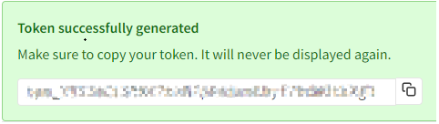

npm access tokens 主要用来在自动化工具中“登录”，获取操作包的权限。有两种类型：

- Legacy tokens
- Granular access tokens

可以在 npm 网站中或使用命令管理 tokens，个人觉得在网站中操作比较方便。

出于安全性考虑，token 在创建完成后是不允许修改设置的。而且 token 值只在创建成功后展示一次，后面无法查看此值。



## Legacy tokens

有效期是永久（expires = never），有三种类型：Read-only，Automation 和 Publish。

执行 `npm login` 时，会自动创建一个 Publish 类型的 token 并使用它；`npm logout` 时会自动删除这个 token。

所以如果要在自动化工具中使用 token，请手动创建一个，不要用登录时 npm 自动创建的 token，不然一退出登录这个 token 就失效了，自动化工具里也用不了了。

## Granular access tokens

可以精确控制的 token：

- 可以设置允许访问哪些包
- 可以设置过期时间
- 可以限制 ip 地址访问
- 可以设置 只读 or 读写

## 在自动化工具中使用 token

比如使用 github workflow 自动发布 npm 包：

- 登录 npm 网站，在个人账号的 Access Tokens 页面创建一个 token。
- 登录 github 网站，打开这个包对应的 repository，在 Settings 面板找到 Secret 设置。创建 secret。
- 在 github workflow 中使用这个 secret：
  ```
  env:
      NODE_AUTH_TOKEN: ${{ secrets.NPM_TOKEN }}
  ```

## 手动删除 token

假设你在公司的电脑中执行了 `npm login`，但是离开前忘记退出了，你担心别人用这台电脑时会操作你的账号。

这时候可以登录 npm 网站，把 access token 清空，这样之前的登录状态就失效了。之后在那台电脑执行任何和账号有关的 npm 操作（比如 `npm whoami`、`npm publish`、`npm token list`）都会失败，报错 401-Unauthorized

---

参考：

- [About access tokens](https://docs.npmjs.com/about-access-tokens)
- [Creating and viewing access tokens](https://docs.npmjs.com/creating-and-viewing-access-tokens)
