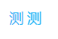
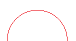
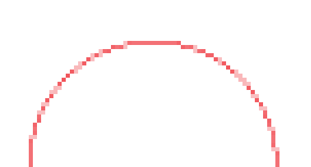
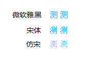
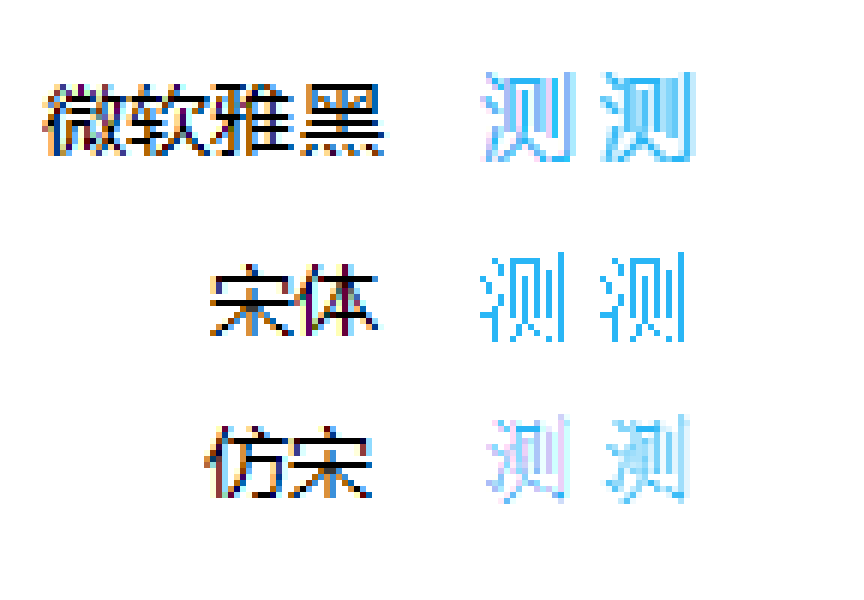

## bug 描述

开发博客网站时发现一个 bug：网站首页左侧的标签与右侧文章的标签使用相同的 `.class`，但是标签文字的颜色却不同（win10 系统，浏览器 chrome 版本为 127.0.6533.101）

我测试了很久才发现页面出现滚动条会使左侧标签颜色变化，之后又研究很久发现是因为左侧标签的父级容器设置了 `position:sticky`。

下面是一个可复现此 bug 的 minimal case：

```html
<style>
  .test {
    position: sticky;
    top: 0;
    color: #29b6f6;
    padding: 100px 0;
  }
</style>
<div class="test">测</div>
```

调整窗口尺寸，可以看出页面有无滚动条时文字的颜色有细微变化。

我把两种颜色效果拼在一张图里了，左边是无滚动条的效果，右边是有滚动条的效果：



将上图放大四倍，颜色差别能很明显看出来了：


## 我的分析

### 像素格子

我 google 了很久没有搜到任何相关内容，只能说一点我自己的猜测分析了。

在电脑上画个圆弧，看上去很光滑：



但是将它放大六倍看是这样的：



因为电脑屏幕由像素点组成，每个像素点只能有一种颜色。肉眼看上去光滑的红色弧线也是由一个个方方正正的带颜色的像素格子组成的，而且这些格子并不都是红色的，还有一些粉色的。这就涉及不同的渲染算法了：粉色格子的 color 值怎么确定？

所以在电脑屏幕上显示图形并不是我原本想象的那么简单。如上面的图里，蓝色的字放大了甚至能看到粉色像素格子：


### 不同字体

我想到不同字体应该也会有影响。我给最上面的例子设置了不同字体进行测试。

没设置 font-family 时默认字体是微软雅黑（我的 win10 系统是这样）。我分别设置了宋体、仿宋，看看对比效果：



微软雅黑和仿宋前后有变化，宋体看上去没变化，放大六倍查看：



宋体颜色前后确实无变化。宋体更“干脆”，笔画和笔画间分得很开。而微软雅黑和仿宋都比较“柔”，笔画和笔画中间会有浅色格子（甚至是粉色）的过渡连接。

### 不同字号

我又测试了同一字体，不同字号的影响。还是用最上面的例子，固定字体为微软雅黑，修改字号看效果：

图不贴了。将字体逐渐调大后，颜色变化越来越微小了：

- 调大至 30px 后，颜色差异还在，但非常非常小，不放大的话只有火眼金睛能看出来。
- 调大至 50px 后，颜色差异完全消失。

我猜测造成这个 bug 的成因是浏览器对 sticky 定位生效的元素，和普通布局的元素的渲染方式有不同。这种渲染方式的差别并不是故意为之的，而且只在很少的情况下会真的导致最终效果的差别。

当字号很小，且字体比较“软”时，只能用很少的像素格子实现圆滑过渡效果。所以就容易“出错”。当调大字号后，可以用更多的像素格子去实现圆滑过渡，更游刃有余，不容易“出错”

### fixed 定位

我预感 fixed 定位的元素也会出现这个效果。测试后发现果然如此，对同一个字设置相同颜色，渲染结果有两种：

1. fixed 定位，sticky 定位生效（即出现滚动条）
2. absolute 定位、relative 定位、static 定位、sticky 定位未生效（即无出现滚动条）

（针对微软雅黑字体，字号 16px，win10 系统，chrome 版本为 127.0.6533.101。文字为“测”，颜色为 #29b6f6）
