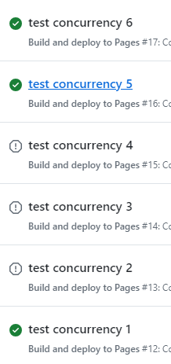
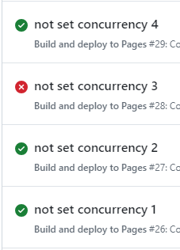

记录使用 github workflow 实现自动部署 Github Pages 的过程。本文为**实况向**，记录研究全程，包含大量试错及踩坑过程。**教程向**看[这篇](post:5968cde5-1851-40c0-9a9e-80647e8ce9c2)

创建项目 lily-test-workflow-deploy-pages，步骤见 [《初始化项目步骤》](post:dac4f67a-a623-47bd-bb79-90df2fb5d046)。

## 静态部署

静态部署指代码中就有要部署的内容，不需要处理可以直接使用。

### 待部署的内容

在项目中新建 lily-pages 文件夹，这就是待部署的目录。

```html
<!-- lily-pages/index.html -->
<!DOCTYPE html>
<html>
  <head></head>
  <body>
    lily testing
  </body>
</html>
```

### workflow 配置文件

创建 workflow 文件：`.github/workflows/static-deploy.yml`，内容参照官方示例[部署静态页面](https://github.com/actions/starter-workflows/blob/main/pages/static.yml)。

本次完全使用官方示例的源码，唯一修改的内容是 `upload-pages-artifact` 的 `path` 改为 `"lily-pages"`：

```yml
# Simple workflow for deploying static content to GitHub Pages
name: Deploy static content to Pages

on:
  # Runs on pushes targeting the default branch
  push:
    branches: [$default-branch]

  # Allows you to run this workflow manually from the Actions tab
  workflow_dispatch:

# Sets permissions of the GITHUB_TOKEN to allow deployment to GitHub Pages
permissions:
  contents: read
  pages: write
  id-token: write

# Allow only one concurrent deployment, skipping runs queued between the run in-progress and latest queued.
# However, do NOT cancel in-progress runs as we want to allow these production deployments to complete.
concurrency:
  group: "pages"
  cancel-in-progress: false

jobs:
  # Single deploy job since we're just deploying
  deploy:
    environment:
      name: github-pages
      url: ${{ steps.deployment.outputs.page_url }}
    runs-on: ubuntu-latest
    steps:
      - name: Checkout
        uses: actions/checkout@v4
      - name: Setup Pages
        uses: actions/configure-pages@v5
      - name: Upload artifact
        uses: actions/upload-pages-artifact@v3
        with:
          path: "lily-pages" # 和官方示例的源码相比只修改了这行。指定部署的是 lily-pages 目录
      - name: Deploy to GitHub Pages
        id: deployment
        uses: actions/deploy-pages@v4
```

用到的 actions：

- [checkout](https://github.com/actions/checkout)：将仓库代码克隆到 workflow 的运行环境
- [configure-pages](https://github.com/actions/configure-pages)：可以简单理解为初始化 Github Pages
- [upload-pages-artifact](https://github.com/actions/upload-pages-artifact)：打包上传 artifact 供后面部署 Github Pages 时使用。
- [deploy-pages](https://github.com/actions/deploy-pages)：将 artifact 部署到 Github Pages

#### artifact

artifact 是指在 workflow 流程中生成的文件或文件集合。这些文件通常是构建、测试或部署过程中产生的输出，例如编译后的二进制文件、测试报告、日志文件等。Artifact 的主要作用是保存这些中间产物，以便在后续的步骤中使用，或者供开发者下载和分析。

官方提供了两个 action 用来上传、下载 artifact：

- [upload-artifact](https://github.com/actions/upload-artifact)
- [download-artifact](https://github.com/actions/download-artifact)

默认情况下不同的 job 间是不能直接共享内容的，因为每个 job 都在独立的环境中运行。但是可以通过 artifact 来实现 job 间共享内容。

### push 触发 workflow

前面在 workflow 中设置了如下内容：

```yml
on:
  # Runs on pushes targeting the default branch
  push:
    branches: [$default-branch]
```

效果为在 push 到默认分支时自动触发 workflow。

但是我实际 push 后并没有触发 workflow。我**以为**是因为 workflow 是在这次 push 中才创建的，所以这一次不能触发（瞎猜的）。所以我随意修改了些无意义的内容（纯粹是为了测试 push），push 后发现还是没有触发 workflow，说明前面猜错了，就是配置有误。

###### $default-branch 只是 template 中的占位符

我试着把 `branches: [$default-branch]` 改成了 `branches: ["main"]`，再 push 成功触发了 workflow（触发了但是运行过程中出错失败了）

研究了一会儿之后找到了 $default-branch 无效的原因：我是把模板源码复制到本地使用的。模板源码中的 `$default-branch`只是模板中的占位符。在 github 网站中选择模板创建 workflow 时，会将此占位符自动替换成当前仓库的默认分支。所以在实际的 workflow 文件中不会存在`$default-branch`。

所以像我一样把 workflow template 的源码复制到本地使用时，需要自行替换 `$default-branch`。

参考：

- [issues - $default-branch not working](https://github.com/orgs/community/discussions/26597)
- [doc -Creating workflow templates for your organization](https://docs.github.com/en/actions/sharing-automations/creating-workflow-templates-for-your-organization)

###### 触发了但运行过程中出错，因为未开启 Pages 功能

虽然实现了 push 时自动触发 workflow ，但是运行中出错：

```bash
HttpError: Get Pages site failed. Please verify that the repository has Pages enabled and configured to build using GitHub Actions, or consider exploring the `enablement` parameter for this action.
```

根据报错信息可知：当前 repository 没有开启 Pages 功能。

前往 repo 主页，在 Settings 中开启 Pages 功能，source 选择 Github Actions。

### 手动执行 workflow

再次测试 workflow 运行效果，这次不通过 push 触发了，而是试试手动执行。

```yml
on:
  # Allows you to run this workflow manually from the Actions tab
  workflow_dispatch:
```

前往 repo 主页，在 Actions 中点击按钮手动执行 workflow。此次运行顺利完成，Github Pages 已经成功部署！

## 动态部署

动态部署，即先构建再部署。

### 准备待部署的内容

待部署的目录还是 lily-pages，但是不在源码中直接提供，而是需要执行脚本生成。

###### 删除 lily-pages

删除 lily-pages 目录，且在 .gitignore 中添加 lily-pages。

因为 lily-pages 已经被 track 过，所以删除时要复杂一点，参考 [《gitignore 无法忽略已经 tracked 的文件》](post:abf5c35c-3656-4162-89c1-742efac46c65)

###### 编写脚本生成 lily-pages

创建 index.js

```js
import { mkdir, writeFile } from "node:fs/promises";
import path from "node:path";
import process from "node:process";

const htmlString = `<!DOCTYPE html>
<html>
  <head></head>
  <body>
    lily testing - build and deploy
  </body>
</html>`;

const pagesDir = path.join(process.cwd(), "./lily-pages");
await mkdir(pagesDir, { recursive: true });
await writeFile(path.join(pagesDir, "index.html"), htmlString);
```

package.json 中添加 script:

```json
  "scripts": {
    "build": "node index.js"
  },
```

### workflow 配置文件

在 workflow 中需要执行 `npm run build` 以获得 lily-pages。这需要先安装 node。

因为项目中的依赖都是 eslint 相关的包，只在本地开发时用到。执行 build 不需要任何依赖，所以 workflow 中不需要 `npm ci` 这一步。

在 checkout 之后，Setup Pages 之前添加 steps：

```yml
# 先安装 node
- name: Setup Node
  uses: actions/setup-node@v4
  with:
    node-version: latest
    cache: npm
# 再执行 build 命令
- run: npm run build
```

用到的 actions：

- [actions/setup-node](https://github.com/actions/setup-node)

测试效果：push 后自动执行 workflow，运行成功！

## 改用 pnpm

### 本地用 pnpm 重新安装依赖

删除项目中的 package-lock.json 和 node_modules。用 pnpm 重新安装依赖。

测试效果：push 后自动执行 workflow 但运行失败，在 Setup Node 这一步报错：

```bash
Dependencies lock file is not found. Supported file patterns: package-lock.json,npm-shrinkwrap.json,yarn.lock
```

这是因为 workflow 的运行环境没有 pnpm，需要自行安装。虽然 workflow 中没有执行任何 pnpm 的命令，但是为了让运行环境识别 `pnpm-lock.yaml`，还是需要安装 pnpm。

### workflow 中安装 pnpm 并设置 cache

修改 workflow：先安装 pnpm，再在安装 Node 时设置使用 pnpm cache（注意顺序）

```yml
- name: Install pnpm
  uses: pnpm/action-setup@v4

- name: Setup Node
  uses: actions/setup-node@v4
  with:
    node-version: latest
    cache: pnpm # 改成 pnpm
```

测试效果：push 后自动执行 workflow，但在执行 Post Install Node.js 这一步时出错了。这一步是收尾工作，构建和部署都在这之前完成了，所以 Github Pages 已经成功部署了。报错内容为：

```bash
Error: Path Validation Error: Path(s) specified in the action for caching do(es) not exist, hence no cache is being saved.
```

查看 [Path Validation Error on Cleanup](https://github.com/actions/setup-node/issues/801) 看相关内容。

我猜测是因为我没有执行 `pnpm install`，所以没有缓存，所以报错。下面验证一下这个猜测。

### build 时添加依赖

为了验证上面的猜测，给 build 脚本随便加一个依赖吧（具体内容不重要略过了）。

修改 workflow，在执行 `npm run build` 前先用 pnpm 安装依赖：

```yml
- run: pnpm install --frozen-lockfile
```

测试效果：workflow 完美运行

###### 在 workflow 中安装依赖时严格遵循 lockfile

[Working with lockfiles](https://github.com/actions/setup-node/blob/main/docs/advanced-usage.md#working-with-lockfiles)

- `npm ci`
- `yarn install --immutable`
- `pnpm install --frozen-lockfile`

## 测试 concurrency

workflow 默认是允许并行的。设置 [concurrency](https://docs.github.com/en/enterprise-cloud@latest/actions/writing-workflows/choosing-what-your-workflow-does/control-the-concurrency-of-workflows-and-jobs) 以实现同一时刻只允许运行一个任务。

### 设置 concurrency 的效果

```yml
# Allow only one concurrent deployment, skipping runs queued between the run in-progress and latest queued.
# However, do NOT cancel in-progress runs as we want to allow these production deployments to complete.
concurrency:
  group: "pages"
  cancel-in-progress: false
```

测试效果：我在短时间内进行了多次 push，在 repo 主页的 Actions 中查看 workflows 的状态：



解释：

- test1 还没有完成时，test2 就来了，test2 排队等待。
- test3 来了，还是排队。test2 被取消。
- test4 来了，还是排队。test3 被取消。
- test5 来了，排队。test4 被取消。
- 此时 test1 终于运行完了，因为中间的 test2 3 4 都被取消了，所以运行 test5。
- test6 来了，排队。
- test5 运行完了。运行 test6。

关于 `cancel-in-progress: false`，官方示例在注释中解释："However, do NOT cancel in-progress runs as we want to allow these production deployments to complete."，但我不太明白这样设置的必要性，

### 未设置 concurrency 的效果

现在把 workflow 配置中的 concurrency 设置去掉，再次测试。



短时间内触发的多条 workflow 会并行执行。其中 test3 在 Deploy to GitHub Pages 这一步失败。

我推测原因是其他任务在同时操作 Github Pages，造成冲突了（类似数据库锁，不允许多人同时访问）。

### 何时需要设置 concurrency

- 同时运行可能导致冲突
- 同时运行会消耗更多时间和存储空间时 —— 文档中是这么写的，我不确定什么含义。我猜是：有的情况下多个任务同时运行比一个个运行还要慢（就像所有车辆都往前挤，不如排好队一个个走快）

## 安装 node 时选择 LTS 版本

安装 node 时如果设置 latest，那么会用真·最新版本，即抢鲜体验版，并不是 LTS 版本。

```yml
- name: Install Node.js
  uses: actions/setup-node@v4
  with:
    node-version: latest
```

如果想要用 LTS 版本，应该设置：

```yml
node-version: lts/*
```

我一开始用 latest 版本，workflow 运行到安装 node 这一步时**偶尔**会重试很多次才能下载成功。~~网上说是因为 node 不是 LTS 版本，我不确定这种说法是否正确，不过姑且改成 LTS 版本了。改之后没有再出现这个问题，但也无法确定是真的解决了还是只是巧了。~~后面我专门研究了这一点，网上说的确实对。具体看 [《github workflow 教程：setup-node》](post:1ece696c-81e0-48fe-a189-29356d178e4c)

---

完整代码见 [workflow-deploy-pages.yml](../post-assets/5f4cbba1-1dd7-4193-8d10-8c0565a24537.yml)
