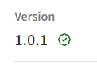
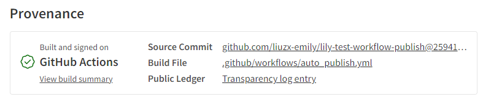

记录使用 github workflow 实现自动 publish npm package with provenance 的过程。本文为**实况向**，记录研究全程，包含大量试错及踩坑过程。**教程向**看[这篇](post:5968cde5-1851-40c0-9a9e-80647e8ce9c2)

创建项目 lily-test-workflow-publish，步骤见 [《初始化项目步骤》](post:dac4f67a-a623-47bd-bb79-90df2fb5d046)。

## publish npm package

### 创建 npm access token

为实现在 workflow 中 publish npm package，需要使用 npm access token（具体查看 [《自动化工具中使用 npm access token 获取权限》](post:ed55a9c8-ae07-406e-a88b-25c494d37502)）。

登录 npm 网站，新建一个 access token（记得给权限）。

### github repository 设置 secret

在 repo 主页 - Settings - Security - Secrets and variables - Actions 中创建 Repository secrets，名称为 lily_npm_token（不区分大小写），值为新建的 npm access token 的值。

更多内容看文档 [Using secrets in GitHub Actions](https://docs.github.com/en/actions/security-for-github-actions/security-guides/using-secrets-in-github-actions)

### github workflow 中使用 secret

workflow 完整代码：

```yml
name: Publish Package to npmjs

on:
  # Runs on pushes targeting the default branch
  push:
    branches: ["main"]

  workflow_dispatch:

jobs:
  publish:
    runs-on: ubuntu-latest # 必需值。没有会报错：Required property is missing: runs-on
    steps:
      - uses: actions/checkout@v4 # 必需步骤
      - run: npm publish
        env:
          NODE_AUTH_TOKEN: ${{ secrets.lily_npm_token }}
```

workflow 运行出错：

```bash
npm error code ENEEDAUTH
npm error need auth This command requires you to be logged in to https://registry.npmjs.org/
npm error need auth You need to authorize this machine using `npm adduser`
```

这个报错信息比较含糊，发布时 npm 权限验证不通过都会报这个错：

- NODE_AUTH_TOKEN 没有设置或者设置错误会报这个错误
- 执行 publish 前没有设置 registry 也会报这个错

修改 workflow，publish 前设置 resitry：（具体看 [Publish to npmjs and GPR with npm](https://github.com/actions/setup-node/blob/main/docs/advanced-usage.md#publish-to-npmjs-and-gpr-with-npm)）

```yml
- uses: actions/checkout@v4
- uses: actions/setup-node@v4
  with:
    registry-url: "https://registry.npmjs.org" # publish 前必须设置 registry
- run: npm publish
  env:
    NODE_AUTH_TOKEN: ${{ secrets.lily_npm_token }}
```

workflow 运行成功。我的 npm 下多出来了新的 package。

## publish with provenance

查看 npm 文档 [Publishing packages with provenance via GitHub Actions](https://docs.npmjs.com/generating-provenance-statements#publishing-packages-with-provenance-via-github-actions)

修改 workflow，发布时设置 provenance：

```yml
- run: npm publish --provenance
  env:
    NODE_AUTH_TOKEN: ${{ secrets.lily_npm_token }}
```

运行 workflow 时出错：

```bash
npm error code EUSAGE
npm error Provenance generation in GitHub Actions requires "write" access to the "id-token" permission
```

按照报错信息的提示修改权限：

```yml
permissions:
  id-token: write # publish with provenance 必须设置 id-token:write。普通 publish 不需要此权限
```

运行 workflow 时出错：

```bash
npm error code E422
npm error 422 Unprocessable Entity - PUT https://registry.npmjs.org/lily-test-workflow-publish - Error verifying sigstore provenance bundle: Failed to validate repository information: package.json: "repository.url" is "", expected to match "https://github.com/liuzx-emily/lily-test-workflow-publish" from provenance
```

按照报错信息的提示，在项目 package.json 中设置 repository.url：

```json
  "repository": {
    "url": "https://github.com/liuzx-emily/lily-test-workflow-publish"
  },
```

运行 workflow 时出错：

```bash
npm error code E403
npm error 403 403 Forbidden - PUT https://registry.npmjs.org/lily-test-workflow-publish - You cannot publish over the previously published versions: 1.0.0.
```

犯了低级错误，没有改 version。执行 `npm version patch` 升级版本，然后 push，这一次 workflow 运行终于成功了！

在 npm 网站 package 主页中能看到 Provenance 信息。版本号旁边有绿色对勾：



在主页下方能看到详细 Provenance 信息：



---

workflow 完整代码：

```yml
name: Publish Package to npmjs

on:
  push:
    branches: ["main"]

  workflow_dispatch:

jobs:
  publish:
    runs-on: ubuntu-latest # 必需值。没有会报错：Required property is missing: runs-on
    permissions:
      id-token: write # publish with provenance 必须设置 id-token:write。普通 publish 不需要此权限
    steps:
      - uses: actions/checkout@v4 # 必需步骤
      - uses: actions/setup-node@v4
        with:
          registry-url: "https://registry.npmjs.org" # publish 前必须设置 registry
      - run: npm publish --provenance
        env:
          NODE_AUTH_TOKEN: ${{ secrets.lily_npm_token }}
```
