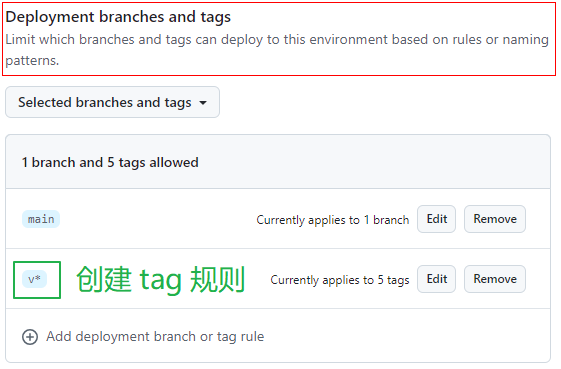
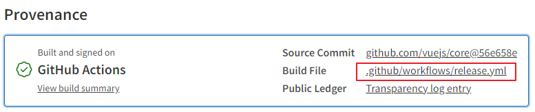

将前两次实战的内容结合起来，在一个 workflow 中实现部署 Github Pages 和发布 npm 包。并且进行一些优化：

- 优化触发条件：前两次实战中触发条件都是 push 到 main，改成发布新版本（git tag）时触发
- 限制发布的 npm 包的内容：只发布 dist 内容
- 发布新版本（git tag）操作固定且繁琐，编写脚本将这一过程自动化

本文完整代码见 [lily-test-workflow.zip](../post-assets/a82ac93b-77d0-4551-981a-b3cfbe54722a.zip)

## 项目基本功能

创建项目 lily-test-workflow，步骤见 [《初始化项目步骤》](post:dac4f67a-a623-47bd-bb79-90df2fb5d046)。

### src 源码目录

创建 src 文件夹，作为源码目录，包含三个文件：

src/index.js:

```js
import { foo } from "./foo";
import { bar } from "./bar";

export const data = foo + bar;
```

src/foo.js:

```js
export const foo = "foo";
```

src/bar.js

```js
export const bar = "bar";
```

### rollup build

发布为 npm 包时只发布 build 后的内容，其他内容（源码、配置文件等）都不发布。

用 rollup build：pnpm 安装 rollup，创建 rollup.config.js：

```js
export default {
  input: "./src/index.js",
  output: {
    dir: "dist",
    format: "es",
  },
};
```

在 package.json 中添加 script build：

```json
  "scripts": {
    "build": "rollup -c rollup.config.js"
  },
```

在 package.json 中设置 main 标记包的入口，设置 files 标记发布包时要包含的内容：

```json
  "main": "dist/index.js",
  "files": ["dist"],
```

设置好了后需要先测试一下效果：在使用自动化工具前，先**手动**执行命令确保代码无误。如果一上来就用自动化工具，一旦出错还要很费劲地区分是代码本身错了，还是自动化工具的配置出错了，很麻烦。

- 测试 build 命令：执行 `npm run build`，成功！生成了 dist/index.js：

```js
const foo = "foo";
const bar = "bar";
const data = foo + bar;
export { data };
```

- 测试发布效果（测试发布后是否只包含 dist）：使用 `npm pack` 测试，成功！pack 后内容只包含 dist 和 package.json（package.json 是强制包含的）

### 生成 Github Pages 页面

编写脚本，生成部署到 Github Pages 的内容：展示当前版本和发布时间

pnpm 安装 moment。创建 scripts/generate-pages.js：

```js
import moment from "moment";
import { mkdir, writeFile } from "node:fs/promises";
import path from "node:path";
import process from "node:process";
import { createRequire } from "node:module";

const packageVersion = createRequire(import.meta.url)("../package.json").version;

async function generatePages() {
  const time = moment(new Date()).format("YYYY-MM-DD HH:mm:ss");
  const htmlString = `
  <!DOCTYPE html>
  <html lang="zh-CN">
    <head><meta charset="UTF-8"></head>
    <body>
      版本 ${packageVersion} 于 ${time} 发布。
    </body>
  </html>`;

  const pagesDir = path.join(process.cwd(), "./lily-pages");
  await mkdir(pagesDir, { recursive: true });
  await writeFile(path.join(pagesDir, "index.html"), htmlString);
}

generatePages();
```

在 package.json 中添加 script：

```json
  "scripts": {
    "generate-pages": "node scripts/generate-pages.js",
  },
```

测试效果。执行 `npm run generate-pages`，成功！生成了 lily-pages/index.html：

```html
<!DOCTYPE html>
<html lang="zh-CN">
  <head>
    <meta charset="UTF-8" />
  </head>
  <body>
    版本 1.0.0 于 2024-09-03 10:05:36 发布。
  </body>
</html>
```

### 其它

.gitignore 添加 lily-pages 和 dist。

## 创建 github workflow

### 创建 workflow 配置文件

优化触发条件：改成发布新版本时触发。见 [Github Docs](https://docs.github.com/en/actions/writing-workflows/choosing-when-your-workflow-runs/events-that-trigger-workflows#running-your-workflow-only-when-a-push-of-specific-tags-occurs)，用 [git tag](post:1be5be72-70d6-440a-9029-3b933183874d) 标记版本

```yml
on:
  push:
    # branches: ["main"]
    tags:
      - "v*" # 匹配以v开头的标签
```

完整代码：

```yml
name: release

on:
  push:
    tags:
      - "v*" # 匹配以v开头的标签
  # Allows you to run this workflow manually from the Actions tab
  workflow_dispatch:

jobs:
  deploy-github-pages:
    # 部署 Github Pages 需要 pages:write 和 id-token:write 权限
    permissions:
      pages: write
      id-token: write
    # 使用 environment。这个名为 github-pages 的 environment 是开启 Pages 功能时自动创建的，它默认不允许在 push tag 时触发操作，需要修改此设置：进入这个 environment 的设置界面，在 Deployment branches and tags 这一栏添加 tag 规则： `v*`。
    environment:
      name: github-pages
      url: ${{ steps.deployment.outputs.page_url }}
    runs-on: ubuntu-latest
    steps:
      - name: Checkout
        uses: actions/checkout@v4
      - name: Install pnpm
        uses: pnpm/action-setup@v4
      - name: Install Node.js
        uses: actions/setup-node@v4
        with:
          node-version: lts/*
          cache: pnpm
      - run: pnpm install --frozen-lockfile
      - run: npm run generate-pages
      - name: Setup Pages
        uses: actions/configure-pages@v5
      - name: Upload artifact
        uses: actions/upload-pages-artifact@v3
        with:
          path: "lily-pages"
      - name: Deploy to GitHub Pages
        id: deployment
        uses: actions/deploy-pages@v4

  # publish with provenance 要求项目的 package.json 中必须设置 repository.url（普通 publish 无需设置）
  publish-npm-package:
    # publish with provenance 需要 id-token:write 权限，普通 publish 不需要此权限
    permissions:
      id-token: write
    runs-on: ubuntu-latest
    steps:
      - name: Checkout
        uses: actions/checkout@v4
      - name: Install pnpm
        uses: pnpm/action-setup@v4
      - name: Install Node.js
        uses: actions/setup-node@v4
        with:
          node-version: lts/*
          cache: pnpm
          registry-url: "https://registry.npmjs.org" # publish 前必须设置 registry
      - run: pnpm install --frozen-lockfile
      - run: npm run build
      - run: npm publish --provenance --access public # 首次发布必须设置 public
        env:
          NODE_AUTH_TOKEN: ${{ secrets.lily_npm_token }} # 需要在 repo 中创建此 secret
```

### 在 github repo 主页设置

###### Pages 相关

在 repo 设置中开启 Pages 功能，此操作会自动创建名为 github-pages 的 environment。
在 workflow 配置文件中 deploy-github-pages job 使用了这个 environment。

此 environment 默认不允许在 push tag 时触发操作，需要修改此设置：进入这个 environment 的设置界面，在 Deployment branches and tags 这一栏添加 tag 规则： `v*`。



###### publish to npm 相关

在 repo 设置中添加 Repository secrets：lily_npm_token。发布 npm 包时用到

### 修改代码

在 package.json 中设置 repository.url（publish with provenance 需要）

```json
  "repository": {
    "url": "https://github.com/liuzx-emily/lily-test-workflow"
  },
```

## 触发 github workflow

发布新版本时触发（这里说的新版本是指 git tag）

### 手动发布新版本

```bash
git tag v1.0.0
git push origin v1.0.0
```

测试效果：触发 github workflow 且执行成功！成功部署 Pages 且成功发布 npm 包。

首次 release 比较简单，因为不需要更新 version。后续 release 都需要更新 version，每次都要执行如下操作：

1. 修改 package.json 中的 version 值：可以手动修改或者执行 `npm version minor --no-git-tag-version`
2. commit and push changes

```bash
git add .
git commit -m "release: v1.1.0"
git push
```

3. 创建 tag 并 push：

```bash
git tag v1.1.0
git push origin v1.1.0
```

### 编写脚本自动发布新版本

上面这套操作太麻烦，写一个脚本自动化：

新建 scripts/release.js，其中用到 enquirer semver picocolors 包，用 pnpm 安装。

```js
import pkg from "enquirer";
import fs from "node:fs";
import { createRequire } from "node:module";
import path from "node:path";
import process from "node:process";
import pico from "picocolors";
import semver from "semver";
import { exec } from "./utils.js";

const { prompt } = pkg;
const currentVersion = createRequire(import.meta.url)("../package.json").version;

const versionIncrements = ["patch", "minor", "major"];
const step = (msg) => console.log(pico.cyan(msg));
const run = async (bin, args, opts = {}) => exec(bin, args, { stdio: "inherit", ...opts });

let versionUpdated = false;
async function getTargetVersion() {
  let res;
  const { release } = await prompt({
    type: "select",
    name: "release",
    message: "Select release type",
    choices: versionIncrements
      .map((o) => {
        const targetVersion = semver.inc(currentVersion, o);
        return `${o} (${targetVersion})`;
      })
      .concat(["custom"]),
  });

  if (release === "custom") {
    const result = await prompt({
      type: "input",
      name: "version",
      message: "Input custom version",
      initial: currentVersion,
    });
    res = result.version;
  } else {
    // release = "patch (1.2.1)" , 正则匹配括号内的内容，tres = 1.2.1
    res = release.match(/\((.*)\)/)?.[1] ?? "";
  }

  if (!semver.valid(res)) {
    throw new Error(`invalid target version: ${res}`);
  }
  return res;
}

function updatePackageVersion(version) {
  const pkgPath = path.join(process.cwd(), "package.json");
  const pkg = JSON.parse(fs.readFileSync(pkgPath, "utf-8"));
  pkg.version = version;
  fs.writeFileSync(pkgPath, JSON.stringify(pkg, null, 2) + "\n");
}

async function gitCommitAndPushChanges(targetVersion) {
  step("\nCommit and Push Changes...");
  await run("git", ["add", "."]);
  await run("git", ["commit", "-m", `"release: v${targetVersion}"`]);
  await run("git", ["push"]);
}
async function gitCreateAndPushTag(targetVersion) {
  step("\nCreate and Push Tag...");
  await run("git", ["tag", `v${targetVersion}`]);
  await run("git", ["push", "origin", `v${targetVersion}`]);
}

async function main() {
  const targetVersion = await getTargetVersion();
  // TODO run tests if needed
  updatePackageVersion(targetVersion);
  versionUpdated = true;
  // TODO generate changelog
  await gitCommitAndPushChanges(targetVersion);
  await gitCreateAndPushTag(targetVersion);
}

main().catch((err) => {
  if (versionUpdated) {
    // revert to current version on failed releases
    updatePackageVersion(currentVersion);
  }
  console.error(err);
  process.exit(1);
});
```

在 package.json 中添加 script：

```json
  "scripts": {
    "release": "node scripts/release.js",
  },
```

测试效果：执行 `npm run release`，成功！自动发布新版本，这触发了 github workflow 执行，自动部署 Pages 和发布 npm 包。

以后每次需要发版的时候，只需要执行 `npm run release` 就可以自动化所有操作。

## 思路来源 vue

本文思路来源 vue。

在 vue 的 npm 主页看到了 Provenance，上面列出了 Build File：



点击查看这个 [release.yml](https://github.com/vuejs/core/blob/main/.github/workflows/release.yml)，内容中最关键的是：

```yml
run: pnpm release --publishOnly
```

去 vue 的 [package.json](https://github.com/vuejs/core/blob/main/package.json) 文件中找到名为 release 的 script：

```json
"scripts": {
  "release": "node scripts/release.js"
}
```

找到 [core/scripts/release.js](https://github.com/vuejs/core/blob/main/scripts/release.js)，学习它的代码。

## 关于自动化的一些思考

> 自动化脚本：一系列预先编写的指令，这些指令可以被计算机自动执行，从而完成特定任务。简单来说，就是让计算机代替人工完成重复性、繁琐的操作，提高效率和准确性。

自动化工具（如 github workflow）是自动化，自己编写的脚本（如上一小节中的 scripts/release.js）也是自动化。

自动化工具就相当于别人写好的脚本，你经过简单的配置就可以直接拿来用，非常方便，能满足大部分需求。自己编写脚本肯定麻烦些，但是没有限制，灵活性高。具体要用哪种按需选择：

- 自动化工具能办到的，自己写脚本肯定也能办到：比如本文的 github workflow 功能可以完全自己编写脚本实现（Github Pages 的 Source 改为 Deploy from a Branch）。
- 但是自己编写脚本能办到的，自动化工具不一定能做到：比如上一小节中的 scripts/release.js 的功能就无法用 github workflow 实现 —— 因为 workflow 只能 checkout 代码，但是不能修改代码库中的代码。
