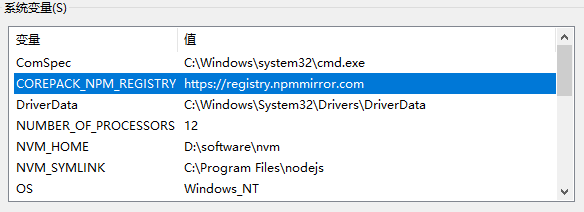

编程时经常需要访问外网（github、node、npm、stackoverflow 等），常常遇到请求被墙的情况。

浏览器可以配置代理（我用的是器插件 SwitchyOmega）访问外网。

但是一些编程工具也需要访问外网（比如 git 推送代码到 github、项目中安装依赖时从 npm registry 下载内容），这些操作也会被墙。幸好它们都提供了设置 mirror 或者 proxy，可以解决被墙问题。

## 区分 mirror 和 proxy

可以通过设置 **mirror** 或者 **proxy** 解决。

### 设置 mirror

设置为国内 ip 可以访问的镜像网站。镜像网站是原网站的**副本**，它（应该）与原网站内容完全一致，但存储在不同的服务器上。

**适用场景有限**：请求是**只读**的，并且**不在乎请求是否是原网站，只在乎返回的内容正确**（比如安装 npm 包）

### 设置 proxy

设置代理（需要有能访问外网的 vpn，一般需自费购买）。

**适用所有场景**，唯一的限制是你的 vpn 流量。

###### 如何确定 proxy 的地址

我的 proxy 就是我自己的 vpn。vpn 服务就在我的电脑上，所以 proxyHost 是 `127.0.0.1`。我使用 clash，端口用的默认的 `7890`。所以我的 proxy 地址就是 `http://127.0.0.1:7890`

设置好 proxy 之后，工具发送的请求都会通过 vpn 了，在 Clash 的 log 里能看到请求记录。

如果没有开启 vpn（即没有启动 clash），请求会出错。比如 git 会报错：

```bash
fatal: unable to access 'xxxx': Failed to connect to 127.0.0.1 port 7890: Connection refused
```

注：使用 Clash 代理时，只要启动 Clash 就可以，不需要开启 Clash 的 `System Proxy` 配置项。

### 使用建议

mirror 能解决部分情况。proxy 能解决所有情况，但是需要耗费你的 vpn 流量。

- 如果你的 vpn 流量很多，可以设置 proxy 解决所有被墙问题，省心。

- 如果像我一样 vpn 流量不多，那么就需要比较麻烦的切换着用。能用 mirror 的情况下用 mirror；不能用 mirror 的情况改用 proxy，比如：
  - 安装 npm 包时，取消 proxy（为了省 vpn 流量），设置 mirror。
  - 发布 npm 包时，必须取消 mirror，设置 proxy

## npm registry 被墙（看情况）{npm_registry}

具体情况具体分析：

- 比如是安装依赖，可以设置 mirror，推荐使用 nrm 管理。

- 比如是 npm login 或者 npm publish，必须用 proxy

```bash
# 设置 proxy
npm config set proxy=http://127.0.0.1:7890

# 查看 proxy
npm config get proxy

# 删除 proxy
npm config delete proxy
```

对于我个人来说，在日常使用中对于 npm 基本都是读操作（安装包），极少有写操作（发布包），所以可以日常设置 mirror 来解决被墙问题。极少情况如发布包时，再取消 mirror 并设置 proxy（完成操作后一定要记得把 proxy 取消掉！因为 `npm i` 等操作也会经过 proxy，会在不知不觉间用光你的 vpn 流量！）

## github 被墙（proxy）

git 设置 proxy

```bash
# 查看 http proxy
git config --global --get http.proxy

# 查看所有 http 配置
git config --global --get-regexp http.*

# 设置 proxy
git config --global http.proxy http://<proxyHost>:<port>

# 取消 proxy
git config --global --unset http.proxy
```

## corepack 被墙（mirror）{corepack}

使用 corepack 安装 pnpm 时可能因为被墙而失败。

corepack 安装包的时候并不使用 npm 设置的 registry，想要修改 corepack 使用的 registry 需要单独设置（参考[corepack 文档](https://github.com/nodejs/corepack?tab=readme-ov-file#environment-variables)）：在操作系统的环境变量中创建 `COREPACK_NPM_REGISTRY`



## nvm 被墙（mirror）{nvm}

执行 `nvm list available` 或 `nvm install <version>` 时等命令需要发送网络请求，可能因为被墙而失败，报错：

```bash
Could not retrieve https://nodejs.org/dist/index.json.

Get "https://nodejs.org/dist/index.json": dial tcp 104.20.22.46:443: i/o timeout
```

给 nvm 设置 node_mirror：

```bash
# nvm-windows 文档中就有提示，贴心：People in China can use `https://npmmirror.com/mirrors/node/`
nvm node_mirror https://npmmirror.com/mirrors/node/
```

如果执行 nvm 命令时需要访问 npm 网站，那么也可能被墙，需要设置 npm_mirror（我暂时没遇到这种情况，想不出来什么情况下 nvm 需要访问 npm 网站，不过设置上总没有坏处）：

```bash
# People in China can use `https://npmmirror.com/mirrors/npm/`
nvm npm_mirror_url https://npmmirror.com/mirrors/npm/
```
