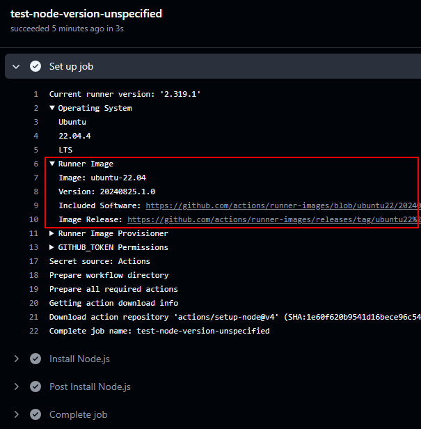

[官方文档](https://docs.github.com/en/actions/about-github-actions/understanding-github-actions)

## 使用 workflow 模板

在 repository 主页 Actions 面板中创建 workflow 时可以选择模板。

###### $default-branch

模板的源码看 [starter-workflows](https://github.com/actions/starter-workflows)。需要注意：模板源码中出现的 `$default-branch` 是模板中的占位符。在 Actions 面板中通过模板创建 workflow 时，会将此占位符自动替换成当前仓库的默认分支。所以在实际的 workflow 文件中不会存在 `$default-branch`。

如果你是把 [starter-workflows](https://github.com/actions/starter-workflows) 中模板的源码复制到本地使用，那么需要自行替换 `$default-branch`。

参考：

- [issues - $default-branch not working](https://github.com/orgs/community/discussions/26597)
- [doc -Creating workflow templates for your organization](https://docs.github.com/en/actions/sharing-automations/creating-workflow-templates-for-your-organization) 文档中说创建模板时如果需要引用存储库的默认分支，可以使用 $default-branch 占位符。创建 workflow 时，占位符将自动替换为存储库默认分支的名称。

## 触发条件

[官方文档](https://docs.github.com/en/actions/writing-workflows/choosing-when-your-workflow-runs)

push 到 main 时触发：

```yml
on:
  push:
    # branches: ["main"]
```

push tag 时触发：

```yml
on:
  push:
    tags:
      - "v*" # 匹配以v开头的标签
```

支持手动触发：

```yml
on:
  # Allows you to run this workflow manually from the Actions tab
  workflow_dispatch:
```

## 运行环境

[官方文档](https://docs.github.com/en/actions/writing-workflows/choosing-where-your-workflow-runs)

为每个 job 设置 runner：

```yml
some-job:
  runs-on: ubuntu-latest
```

在 workflow 运行情况中可以查看本次运行使用的 runner：



上图显示：本次运行 runner 是 ubuntu-22.04，点击 [Included Software 链接](https://github.com/actions/runner-images/blob/ubuntu22/20240825.1/images/ubuntu/Ubuntu2204-Readme.md) 查看它内置的软件和缓存：

- 内置了 `node@18.20.4`、`npm@10.7.0`、`yarn@1.22.22`
- 缓存了 node 的 `16.20.2`、`18.20.4`、`20.17.0` 版本。

所以在这个 runner 中运行时：

- 如果 setup-node 时不指定 node 版本，则会使用它内置的 node@18.20.4。
- 如果 setup-node 指定 node 为 16.20.2，因为它缓存了这个版本，可以直接切换使用，不需要下载。
- 如果项目使用 yarn，因为它内置了 yarn，所以不需要安装 yarn。
- 如果项目使用 pnpm，因为它没有内置 pnpm，所以必须在 job 中先安装 pnpm。

```yml
- name: Install pnpm
  uses: pnpm/action-setup@v4
- name: Install Node.js
  uses: actions/setup-node@v4
  with:
    cache: pnpm
```

## job

一个 workflow 中可以包含一个或多个 job。默认情况下，每个 job **并发**、**独立**运行。

- 并发：一个 workflow 中的多个 job 同时运行，不分先后。
- 独立：每个 job 运行在自己独立的 runner 中，文件不互通。

一个 job 执行失败了不会影响其他 job 运行。

### needs

使用 [needs](https://docs.github.com/en/actions/writing-workflows/choosing-what-your-workflow-does/using-jobs-in-a-workflow#defining-prerequisite-jobs) 规定 job 运行前必须**成功**完成的所有其它工作。

如下：按顺序运行：job1 -> job2 -> job3。job1 如果失败则 job2 job3 都不会执行。

```yml
jobs:
  job1:
  job2:
    needs: job1
  job3:
    needs: [job1, job2]
```

如果要求 needs 的工作失败了也继续执行。如下面的代码：job1 和 job2 并发执行，等它们两个都执行完（无论成功还是失败），才开始执行 job3

```yml
jobs:
  job1:
  job2:
  job3:
    if: ${{ always() }}
    needs: [job1, job2]
```

## actions

在 [Github Marketplace](https://github.com/marketplace?type=actions) 中查找 actions。开发者可以上传 actions，所以同种功能的 actions 很多，可以随意选择。

常用 actions：

- [checkout](https://github.com/actions/checkout)：检出代码供 workflow 使用
- [actions/setup-node](https://github.com/actions/setup-node)：安装 node。详细内容见[《github workflow 教程：setup-node》](post:1ece696c-81e0-48fe-a189-29356d178e4c)
  - 可以指定 node 版本，推荐 lts
  - 可以设置 cache 缓存依赖项，支持 npm pnpm yarn
  - 发布 npm 包前必须设置 registry-url
  - [Working with lockfiles](https://github.com/actions/setup-node/blob/main/docs/advanced-usage.md#working-with-lockfiles)

## artifact

[artifact](https://docs.github.com/en/actions/writing-workflows/choosing-what-your-workflow-does/storing-and-sharing-data-from-a-workflow) 是指在 workflow 流程中生成的文件或文件集合。这些文件通常是构建、测试或部署过程中产生的输出，例如编译后的二进制文件、测试报告、日志文件等。

官方提供了两个 action 用来上传、下载 artifact：

- [upload-artifact](https://github.com/actions/upload-artifact)
- [download-artifact](https://github.com/actions/download-artifact)

artifact 的作用：

- 保存 workflow 运行中产生的文件，在 workflow 完成后还可以下载查看。
- 在不同的 job 间共享内容（因为每个 job 在独立的 runner 中运行，默认是无法互通数据的）

## 具体案例：部署 pages

本文是教程向，实况向[看这里](post:6310ff5b-e4a3-4f5f-b685-b03f38613cc3)。

部署 Github Pages 用到的 actions：

- [configure-pages](https://github.com/actions/configure-pages)：enable Pages and extract various metadata about a site
- [upload-pages-artifact](https://github.com/actions/upload-pages-artifact)：packaging and uploading artifact that can be deployed to GitHub Pages
- [deploy-pages](https://github.com/actions/deploy-pages)：publish artifacts to GitHub Pages for deployments

### 准备工作

在 repo 主页 Settings 中开启 Pages 功能，source 选择 Github Actions。

开启 Pages 功能会自动创建名为 github-pages 的 environment。在 workflow 配置文件中使用了这个 environment。

如果你的 workflow 触发条件是 push tag，那么需要修改此 environment 的设置，因为这个 environment 默认不允许在 push tag 时触发操作。进入这个 environment 的设置界面，在 Deployment branches and tags 这一栏添加 tag 规则： `v*`（和你设置的 on 规则一致）。


### 配置文件

部署 Github Pages 需要 `pages: write` 和 `id-token: write` 权限

```yml
permissions:
  pages: write
  id-token: write
```

必须设置 concurrency：具体效果见[实况向](post:6310ff5b-e4a3-4f5f-b685-b03f38613cc3)，有详细描述。

```yml
# Allow only one concurrent deployment, skipping runs queued between the run in-progress and latest queued.
# However, do NOT cancel in-progress runs as we want to allow these production deployments to complete.
concurrency:
  group: "pages"
  cancel-in-progress: false
```

使用名为 github-pages 的 environment，它是开启 Pages 功能时自动创建的。

```yml
environment:
  name: github-pages
  url: ${{ steps.deployment.outputs.page_url }}
```

在 upload-pages-artifact 中设置 path 字段，这是部署到 Pages 的目录。

[配置文件完整代码](../post-assets/252be65e-7826-4d06-a647-08e6d2354b74.yml)

## 具体案例：发布 npm 包

本文是教程向，实况向[看这里](post:13b80421-c3ec-4c43-89d8-6dee8fb2b71a)。

### 准备工作

登录 npm 网站，在个人账号的 Access Tokens 页面创建一个 token（记得给权限）。

在 repo 主页 Settings 中创建 secret，值为新建的 npm access token 的值

### 配置文件

publish 前必须先设置 registry

publish 时设置 env.NODE_AUTH_TOKEN

```yml
steps:
  - uses: actions/checkout@v4
  - uses: actions/setup-node@v4
    with:
      registry-url: "https://registry.npmjs.org" # publish 前必须设置 registry
  - run: npm publish
    env:
      NODE_AUTH_TOKEN: ${{ secrets.lily_npm_token }}
```

### publish with provenance

上面是普通 publish。publish with provenance 需要一些额外操作。

需要 `id-token: write` 权限：

```yml
permissions:
  # publish with provenance 必须设置 id-token: write。普通 publish 不需要此权限
  id-token: write
```

在项目 package.json 中设置 repository.url：

```json
  "repository": {
    "url": "https://github.com/liuzx-emily/lily-test-workflow-publish"
  },
```

首次发布一个包时，如果是 provenance，则必须同时设置 access public：

```yml
- run: npm publish --provenance --access public # 首次发布必须设置 public
      env:
        NODE_AUTH_TOKEN: ${{ secrets.lily_npm_token }} # 需要在 repo 中创建此 secret
```

为了顺利发布，要保证每次触发 workflow 执行时 package.json 中的 version 都有变化。

[配置文件完整代码](../post-assets/cbce0c68-8102-4cbc-bc61-ce71dbcd650f.yml)
