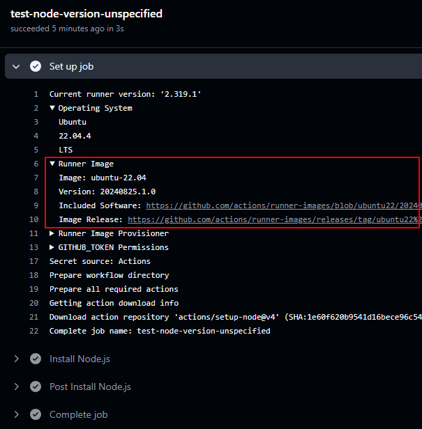
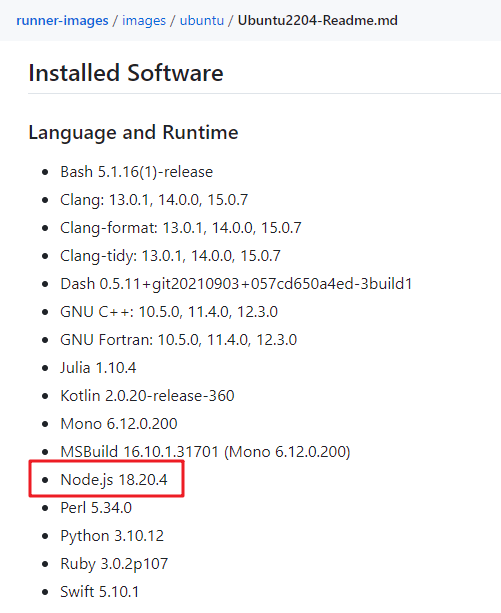
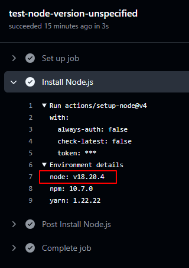
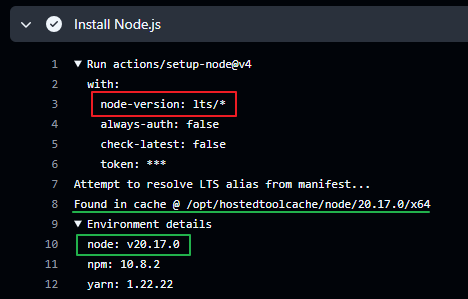
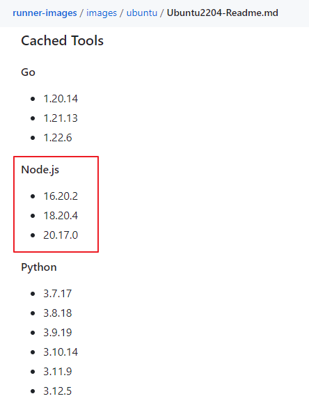
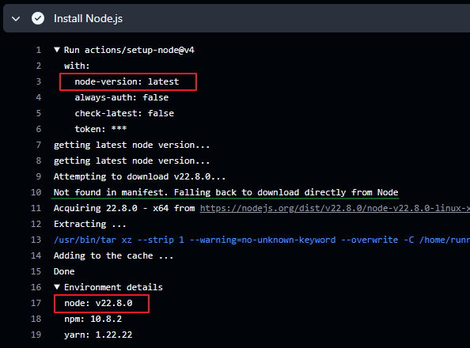
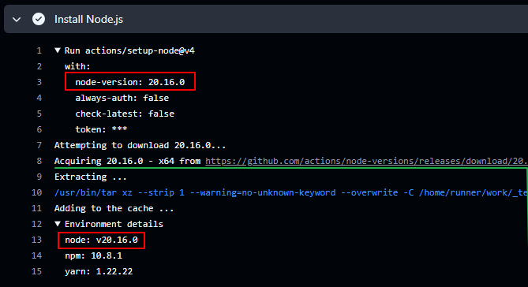

## node-version

```yml
- name: Install Node.js
  uses: actions/setup-node@v4
  with:
    node-version: lts/*
    # node-version: latest
```

### 未指定 node-version

如果未指定 node-version，则使用当前 runner 的 `Path` 中的版本。

```yml
test-node-version-unspecified:
  runs-on: ubuntu-latest
  steps:
    - name: Install Node.js
      uses: actions/setup-node@v4
```

指定 runner 为 ubuntu 最新版。在 github 网站上可以查看每次 workflow 的运行情况，其中就可以查看 runner 信息：



此次运行的 runner 是 ubuntu-22.04 版本，点击 [Included Software 链接](https://github.com/actions/runner-images/blob/ubuntu22/20240825.1/images/ubuntu/Ubuntu2204-Readme.md) 查看它内置的软件，在打开的页面中搜索 node，能看到它使用 18.20.4 版本：



查看 workflow 运行情况，在 setup-node 这一步直接使用 18.20.4 版本：



### 指定使用 lts 版本

```yml
test-node-version-lts:
  runs-on: ubuntu-latest
  steps:
    - name: Install Node.js
      uses: actions/setup-node@v4
      with:
        node-version: lts/*
```

查看此时 workflow 运行情况。runner 情况和上面相同，不重复说明了。

如下图，安装 node 时先解析 lts 版本对应的版本号，是 20.17.0。在 runner 的 cache 中找到对应版本的 node，所以直接使用：



runner 中 cache 了哪些内容还是查看上面提到的 [Included Software 链接](https://github.com/actions/runner-images/blob/ubuntu22/20240825.1/images/ubuntu/Ubuntu2204-Readme.md)



### 指定使用 latest 版本

```yml
test-node-version-latest:
  runs-on: ubuntu-latest
  steps:
    - name: Install Node.js
      uses: actions/setup-node@v4
      with:
        node-version: latest
```

查看 workflow 运行情况：安装 node 时先解析 latest 对应版本号，是 22.8.0。在 runner 的 cache 中没有对应版本的 node，需要下载。
下载时先去 manifest 中查找，但是没找到（因为 manifest 中只有 lts 版本），fall back 去 node 官网直接下载。



### 指定具体版本号

```yml
test-node-version-specific-version:
  runs-on: ubuntu-latest
  steps:
    - name: Install Node.js
      uses: actions/setup-node@v4
      with:
        node-version: 20.16.0
```

指定的版本 20.16.0 不在 runner 的 cache 中，需要下载。下载时先去 manifest 中找，找到了：



### 总结

看完上面的几个例子，再看 setup-node 的[文档](https://github.com/actions/setup-node?tab=readme-ov-file#usage)就更好理解了。

- 未指定 node-version 时，使用 runner 的 node 版本
- 指定了 node-version，先看 runner 的 cache 中是否有此版本
  - cache 中有就直接用
  - cache 中没有则需要安装。先去 [manifest](https://github.com/actions/node-versions) 中找 lts 版本；找不到再去 [nodejs 官网 dist](https://nodejs.org/dist/)直接下载。

当你指定 latest 版本，它必然不在 runner 的 cache 中，也不在 manifest 的 lts 版本中，所以只能从 nodejs 官网下载，很费时间。而且有时候会出现访问 nodejs 官网失败，重试很多次也失败的情况。所以强烈建议不要用 latest 版本。

推荐用法：

- 如果对 node 版本有特定要求，则指定具体版本。
- 如果没有特定要求，则指定最新的 lts 版本（`node-version: lts/*`）。因为 runner 里（应该）都缓存了 node 的 lts 版本，在执行 workflow 的时候可以直接用缓存，更快速。

## cache

[github Actions 文档：Caching dependencies to speed up workflows](https://docs.github.com/en/actions/writing-workflows/choosing-what-your-workflow-does/caching-dependencies-to-speed-up-workflows)

###### 为什么要缓存？

每次运行 job 都是在一个干净的 runner 镜像中，所以每次都需要重新下载依赖，很费时间。

###### 如何缓存

使用 [actions/cache](https://github.com/actions/cache) 缓存依赖项。

actions/setup-node 内置了 cache 功能（它在内部调用 actions/cache），只需要简单配置即可使用 cache。

注：下面介绍的内容都是 setup-node 的缓存行为，而不是通用的 [actions/cache](https://github.com/actions/cache)。

setup-node 中的 cache 功能默认关闭。支持 npm pnpm yarn。指定 cache 时包管理器必须是已经安装好了的。

```yml
- uses: actions/setup-node@v4
  with:
    # Used to specify a package manager for caching in the default directory. Supported values: npm, yarn, pnpm.
    # Package manager should be pre-installed
    cache: "npm"
```

###### 缓存原理

在项目根目录中查找包管理器的 lock 文件，将它的 hash 值作为 cache key 的一部分。当有多个 lock 文件时，或者 lock 文件在子文件夹中时，使用 `cache-dependency-path` 设置 lock 文件路径。

缓存的内容存在 Github 服务器上，在 repo 主页 Actions 面板可以查看、删除 caches。

## registry-url

发布 npm 包之前必须设置 registry：

```yml
publish:
  runs-on: ubuntu-latest
  steps:
    - uses: actions/checkout@v4
    - uses: actions/setup-node@v4
      with:
        registry-url: "https://registry.npmjs.org" # publish 前必须设置 registry
    - run: npm publish
      env:
        NODE_AUTH_TOKEN: ${{ secrets.lily_npm_token }}
```

## working with lockfiles

[官方文档](https://github.com/actions/setup-node/blob/main/docs/advanced-usage.md#working-with-lockfiles)

提交 lock 文件。CI 或 CD 工具中安装依赖时命令有所不同：

- `npm ci`
- `yarn install --immutable`
- `pnpm install --frozen-lockfile`
