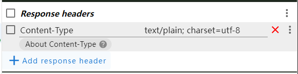
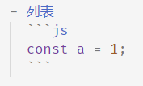

此博客网站建立已经有两个月的时间了，这期间我也写了不少新文章。我根据自己写、看文章的实际体验，修改、新增了一些功能，在这里统一记录（PS：可以按照自己的想法随时修改真的爽，比以前在其它平台上写文章顺心多了(_^\_^_)）。

我也发现了一些问题，但不知道如何解决，也记录在这里。

## 功能变更

### 写文章

- draft：添加草稿功能，草稿文章仅在本地开发时的网页中显示。

- series：添加系列设置（部分文章仅靠 category 和 tag 感觉很难组织，所以添加了 series 概念）

- assets：以前 assets 中只有图片，现在可以有其他类型了，通过链接的形式在文章中引用（比如想在文章中附上源码，但是源码太长了不方便全部展示，所以作为资源链接到文章中）

###### 文章中的“链接”

- 可以链接 [另一篇文章](post:1be5be72-70d6-440a-9029-3b933183874d)，并且可以指定跳转到文章的某个标题
- 可以链接 [本地资源](../post-assets/252be65e-7826-4d06-a647-08e6d2354b74.yml)（图片资源常用 `` 直接在当前页面展示）
- 可以链接 [playground](https://liuzx-emily.github.io/playground/#/super-uploader) 项目的 Pages
- 可以链接 [demo](https://liuzx-emily.github.io/blog-demo/background-attachment-fixed/) 项目的 Pages（常常使用 `<iframe>` 直接在当前页面展示）

链接方式按需选择。比如：

- 文章介绍某个 css 属性，仅凭文字说明很难描述清楚效果，需要实际演示 —— 代码放在 **demo** 中，通过 iframe 在当前文章页面展示，比如[这篇文章](post:071dc549-397f-462e-8796-4e45a39b9f9d)
- 实现了一个相对完整、独立的功能，想要把实现过程记录下来 —— 代码放在 **playground** 项目中，文章链接到 playground 的演示页面和源码，比如 [这篇文章的开头](post:e804da0f-9378-4047-83f7-ec37487f2cd9)
- 文章末尾想要附上完整代码，但是这段代码不值当放在 playground 或 demo 中 —— 将代码放在 assets 中，比如 [这篇文章的末尾](post:5968cde5-1851-40c0-9a9e-80647e8ce9c2)

### 看文章

在网站中看文章

- 文章详情页面

  - 添加同系列文章展示，此区域只展示文章的 brief 标题
  - 添加目录

- 文章列表页面

  - 同一天发布的文章按名称排序（createTime 只精确到日期。为了让同一天发布的同系列文章能按顺序显示）
  - 系列按照文章创建时间降序排序

- 添加移动端适配

### 其它

###### md to html

```js
const converter = new Showdown.Converter({
  // strikethrough 和 tables 功能默认关闭，需要手动开启
  strikethrough: true,
  tables: true,
  // 默认情况 showdown 对子列表的要求是必须四个空格。但是我的 vscode 格式化子列表是两个空格，所以要设置这项
  disableForced4SpacesIndentedSublists: true,
  // Turning this on will stop showdown from interpreting underscores in the middle of words as <em> and <strong> and instead treat them as literal underscores.
  literalMidWordUnderscores: true,
});
```

###### 添加命令 create-post

以前我创建新文章的方法是随便复制一个文章，然后再改。但是我经常忘记修改新文章的 id。这就导致文章 id 不唯一，网站中展示就会出问题。我当时为了解决这个问题，还计划在生成数据时检查重复 id。

后来我想到可以写一个命令用来创建新文章，这样大大简化了操作，而且也不会再出现重复 id 的问题了。

###### 添加 temp 目录

有些文章还在非常初期的阶段，连 draft 都不算，可能只是记录了 idea。这些文章以前都在 src/posts 下堆着，我每次执行 `git rebase` 时，都需要把它们 stash，很麻烦，所以我干脆创建了一个 temp 目录用来存放这些内容（temp 目录被 gitignore）。

这之后我把所有临时内容都放在 temp 下。比如写文章过程中需要临时测试某个 case，就把测试用的 html 放在 temp 里。

## 存在的问题

发现但是不知道如何解决的问题

### asset 内容中文乱码

asset 内容如果有中文，在网站上看中文会乱码，比如 [workflow.yml](../post-assets/252be65e-7826-4d06-a647-08e6d2354b74.yml)。将乱码的文件下载到本地打开后中文又可以正常显示了

我给浏览器安装了一个插件 [ModHeader](https://modheader.com/modheader)，它可以修改请求的 request header 和 response header。我一通测试后发现给 response header 设置 `Content-Type:text/plain; charset=utf-8`后就可以正常显示中文了：



所以应该就是文件的 encoding 的问题，但是我研究了很久也没找到如何设置。部署到 Github Pages 上后，asset 内容里的中文还是会乱码，所以应该不是 vite 的设置问题（因为 asset 放在 public 文件夹内，打包时 vite 不会修改 public 文件夹中的内容）。

### 跳转到文章指定标题失效

比如点击链接[《npm/git/corepack/nvm 被墙可以通过设置 mirror 或 proxy 解决》](post:bb085790-9987-4479-9188-6bdbff059cd4#nvm) 应该会跳转到文章的 nvm 这一部分。

在开发此功能后一段时间内都一切正常，某一天使用时突然发现失效了，我猜测可能是由于某次浏览器更新导致的。

我监听 window 的 scroll 事件，发现页面加载后触发了多次 scroll 事件：第一次 scroll 是我触发的（即跳转到某个标题位置），但在这之后触发的几次 scroll 找不到动作来源，我怀疑就是浏览器的机制。

我找不到这些不明的 scroll 来源，所以姑且加了一个 500ms 的 timeout 去延后执行我的 scroll：

```js
onMounted(() => {
  if (route.query.headerId) {
    const scrollTarget = document.querySelector("#" + route.query.headerId);
    if (scrollTarget) {
      setTimeout(() => {
        scrollTarget.scrollIntoView({ behavior: "instant" });
      }, 500);
    }
  }
});
```

### showdown 语法

showdown 的列表中无法包含 pre

比如 md 有如下内容：



转换成 html 后应该为：

```html
<li>
  <p>列表</p>
  <pre>略</pre>
</li>
```

但是 showdown 转换后变成了：

```html
<li>
  <p>列表</p>
</li>
<pre>略</pre>
```

### super-dev 无法检测出运行过程中 categories 文件变化造成的无效分类

【此问题不予解决】

super-dev 中监听 posts 目录的变化，每有变化就会重新生成 posts 数据。在生成 posts 数据的过程中会检查文章分类是否有效。

- 在运行过程中修改某篇 post.md 的 category，使其变为无效分类，这可以被检查出来。
- 在运行过程中修改 src/categories.js 文件的内容，此行为不会触发重新生成 posts 数据（这是意料中的）。但是即使这之后由某篇文章变化触发重新生成 posts 数据，在生成 posts 数据的过程中也无法检查出无效分类。

检查无效分类的代码是这样写的：

```js
import { watch } from "node:fs";
import { readFile } from "node:fs/promises";
import { categories } from "./categories.js";

async function checkCategories() {
  const content = await readFile("./post1.md");
  const category = extractCategoryFromContent(content);
  if (!categories.includes(category)) {
    console.error(`文章包含无效分类 - ${category}`);
  }
}

async function run() {
  await checkCategories();
  watch("./post1.md", checkCategories);
}
```

在 checkCategories 方法中：

- post.md 的内容是通过 `fs.readFile` 读取的，所以每次执行 checkCategories() 都会重新读取内容
- categories 的内容是在文件中通过静态的 `import` 引用的。程序运行时会把文件缓存到内存中，运行时使用内存中的文件。在运行过程中即使修改了 categories 的内容，程序也不会响应，因为程序用的还是内存中缓存的版本。

这个问题也好解决：

1. 监听 categories 的变化，发现变化也检查是否有无效分类。
2. 检查无效分类时，不通过 `import` 获取 categories，而是通过 `fs.readFile` 等方法读取文件并自己解析内容。

但我觉得这个问题的影响微乎其微，而且改后会影响 super-dev 的性能（super-dev 的性能决定写文章的体验，是极其重要的），所以我决定**不修复此问题**，知道有这个情况就可以了。
