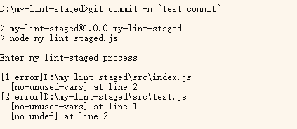
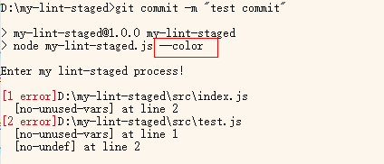
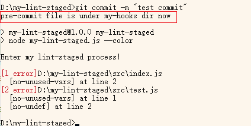
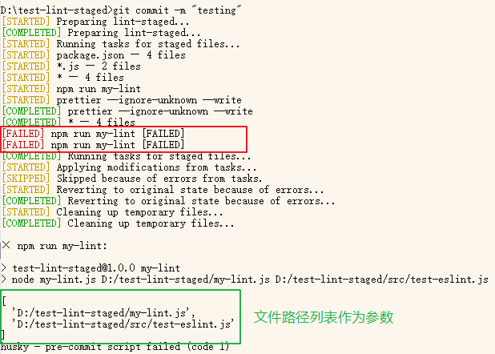

## What is lint-staged？

[lint-staged](https://github.com/lint-staged/lint-staged): run lint on git staged files

在 commit 前运行 Linting 很有必要。这样做可以确保 no errors go into the repository 并且 enforce code style。但对项目中所有文件运行 lint 会非常耗时，而且没必要。只需要 lint 你将要提交的文件就足够了。

lint-staged 的原理：使用 git hook [pre-commit](https://git-scm.com/docs/githooks#_pre_commit) 在 commit 前检查所有 staged files。如果需要阻止 commit，则 pre-commit should exit with non-zero status.

## 自制简易版 lint-staged

为了更好地理解 lint-staged 的原理，我决定自己实现一个简易版。

### pre-commit

执行 git commit 的过程中，首先触发的 hook 就是 pre-commit，此时用户还没有输入 commit message。此 hook 用来检查待提交的代码。

没有参数，因为所有的信息都可以在脚本内自己执行 git 命令获取，比如 `git diff --name-only --cached` 获取所有 staged files

Exit with non-zero status 可以中止 commit 过程，但是注意此行为可以被 `git commit --no-verify` 绕过。

### Step1：固定阻止 commit

创建 `.git/hooks/pre-commit`，效果为固定阻止 commit

```bash
#!/usr/bin/env sh

echo "Commit blocked! This script is configured to always prevent commits."
exit 1 # exit with non-zero status to prevent commit
```

测试效果：执行 commit，控制台输出信息并阻止了 commit。成功~

### Step2：将代码放到 nodejs 脚本中

把代码挪到 nodejs 脚本中，pre-commit 中运行此脚本：

创建 my-lint-staged.js：

```js
import process from "node:process";

console.log("Enter my lint-staged process!..Block commit!");
process.exit(1);
```

在 package.json 中添加 script：

```json
  "scripts": {
    "my-lint-staged": "node my-lint-staged.js"
  },
```

pre-commit 中运行此 script

```bash
#!/usr/bin/env sh

npm run my-lint-staged
```

这样就把代码挪到 nodejs 文件中了。

测试效果：执行 commit，控制台输出信息并阻止了 commit。成功~

### Step3：用 eslint 检查 staged files

安装 [simple-git](https://github.com/steveukx/git-js#readme)（简化 git 操作）和 [chalk](https://github.com/chalk/chalk#readme)（log with styles）。

初始化 eslint（npm init @eslint/config）

修改 my-lint-staged.js：

```js
import process from "node:process";
import simpleGit from "simple-git";
import { ESLint } from "eslint";
import chalk from "chalk";

console.log("Enter my lint-staged process!\n");

async function getStagedFiles() {
  try {
    // get staged files
    const git = simpleGit();
    const stagedFiles = await git.status().then((status) => status.staged);
    // lint staged files
    const eslint = new ESLint({ fix: true });
    const { filesHavingErrors } = await lintAndFix(eslint, stagedFiles);
    if (filesHavingErrors.length > 0) {
      outputLintingErrors(filesHavingErrors);
      process.exit(1);
    } else {
      console.log("No linting errors found.");
      process.exit(0);
    }
  } catch (error) {
    console.error("Error getting staged files:", error);
    process.exit(1);
  }
}

getStagedFiles();

async function lintAndFix(eslint, filePaths) {
  const lintResults = await eslint.lintFiles(filePaths);
  const filesHavingErrors = lintResults.filter((result) => result.errorCount > 0);
  return { lintResults, filesHavingErrors };
}

function outputLintingErrors(filesHavingErrors) {
  const output = filesHavingErrors
    .map(({ filePath, errorCount, messages }) => {
      const errors = messages
        .filter((message) => message.severity === 2)
        .map(({ ruleId, line }) => {
          return `  [${ruleId}] at line ${line}`;
        });
      return `${chalk.red(`[${errorCount} error]`)}${filePath} \n${errors.join("\n")}`;
    })
    .join("\n");
  console.log(output);
}
```

测试效果：执行 commit，控制台输出 eslint error 并阻止了 commit。但是文字没有应用颜色



我测试了一下，直接运行脚本 `npm run my-lint-staged` 时颜色正常。只有通过 pre-commit 调用时才会没颜色。我查了一下得知 pre-commit 默认会阻止 output 的 style。执行脚本时携带 `--color` 可以开启颜色。

修改 package.json：

```json
  "scripts": {
    "my-lint-staged": "node my-lint-staged.js --color"
  },
```

测试效果：执行 commit，控制台输出**带颜色的** eslint error 并阻止了 commit。



### Step4 将 hook 存入代码库中

hook 文件默认是放在 `项目根目录/.git/hooks` 中，但是 .git 目录下的内容不会被 versioned。

如果你想要将 hook 文件持久化（比如需要 share git hooks with your team），就需要将其挪出 .git 目录。

创建 my-hooks 目录，把之前的 pre-commit 文件移动至此目录下。执行 `git config core.hooksPath my-hooks` 将 my-hooks 目录设置为存放 hooks 的目录

为了看出来是否成功，在 pre-commit 中添加一行输出信息：

```bash
#!/usr/bin/env sh

echo "pre-commit file is under my-hooks dir now"
npm run my-lint-staged
```

测试效果：执行 commit，控制台输出 eslint error 并阻止了 commit。而且携带了新加的信息，说明 hook 已经成功挪出来了。



### 总结&源码

使用 git hook pre-commit 在 commit 前检查所有 staged files。如果发现 lint 错误就输出错误信息，并且 exit with non-zero status —— 这会阻止 commit 执行。

hook 目录默认为 `项目根目录/.git/hooks`，这里的内容不会被 versioned。如果需要将 hook 也存入代码库中，则要将 hook 挪出去并修改 git hooksPath。

[自制简易版 lint-staged 项目源码.zip](../post-assets/cbee076e-3adf-4cad-bf3b-1d4b8177de48.zip)

## 使用 lint-staged

参考 [lint-staged 文档](https://github.com/lint-staged/lint-staged?tab=readme-ov-file#installation-and-setup)

### Step1 安装 lint-staged

```bash
npm install --save-dev lint-staged
```

### Step2 配置 lint-staged

在 package.json 中 设置 lint 规则比如：

```json
  "lint-staged": {
    "*.js": "eslint --fix",
     "*.{js,html,css}": "prettier --write"
  }
```

注意使用的 linter 需要提前安装并配置好

### Step3 设置 pre-commit 中运行 lint-staged

常用 [Husky](https://github.com/typicode/husky) 简化配置 git hook 的操作

1. 安装 husky
2. 初始化 husky：`npx husky init`（此命令会在 .husky 目录下创建 pre-commit 文件，并在 package.json 中添加 prepare script）

```json
"scripts": {
    "prepare": "husky"
  },
```

3. 修改 .husky/pre-commit 文件，让它执行 lint-staged：

```bash
npx lint-staged
```

### 使用自定义 linter

如果市场上现有的 linter（eslint，prettier 等）不能满足你的需求，可以自定义 linter。

添加 script my-lint：

```json
"scripts": {
  "my-lint": "node my-lint.js"
},
```

修改 lint-staged 配置：

```json
"lint-staged": {
  "*.js": [
      "npm run my-lint",
      "eslint --fix"
  ],
},
```

这样设置后，就会先执行 my-lint，（如果没有错误）再执行 eslint。

###### 在自定义 linter 中接受参数

lint-staged 执行脚本时会将文件路径作为参数传递。

比如 staged 文件为 `file1.js`、`file2.html`、`file3.js`，那么 lint-staged 内部运行 my-lint 的命令为

```bash
npm run my-lint file1.js file3.js # 没有 file2，因为不是 js 文件
```

在 my-lint.js 中通过 `process.argv.slice(2)` 接收参数：

```js
import process from "node:process";

console.log(process.argv.slice(2)); // 输出参数，是文件路径的列表
// 拿到文件列表后，可以检查文件路径、文件内容，看具体需求了
process.exit(1); // 阻止 commit
```

效果：commit 被阻止，并且在控制台输出信息：


