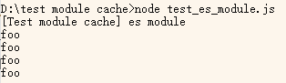
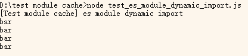
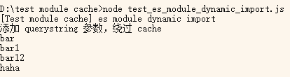
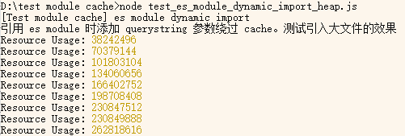
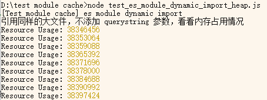
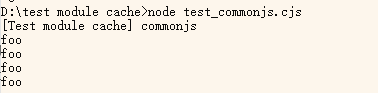
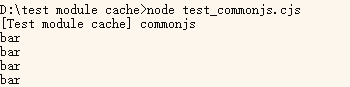
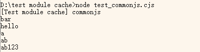

nodejs 有两个模块系统：**CommonJS modules** 和 **ECMAScript modules**。nodejs 处理这两种模块时都有 **cache** 机制：module 第一次加载后会放入内存中，之后再次引用 module 都直接使用内存里的对象。也就是说如果在 nodejs 程序运行的过程中修改已经引用的文件的内容，程序是不会响应这一变化的。

我在开发博客网站时，也遇到了因 cache 而导致的问题：super-dev 中监听 posts 目录的变化，每有变化就会重新生成 posts 数据。在生成 posts 数据的过程中会检查文章分类是否有效。如果在运行过程中修改了分类文件的内容，在检查的时候使用的还是原先的分类数据（因为分类文件内容已经被 cache 到内存中了）。具体情况记录在[《个人博客网站开发记录：功能更新及问题总结》](post:b59aa10f-f562-4b22-b3ee-c29240d5df00#unable_to_detect_invalid_categories_caused_by_changes_in_categories_files_during_runtime)中。

虽然 nodejs 对两种模块都应用了 cache，但是有一个重大区别：

- [commonjs module](https://nodejs.org/api/modules.html#requirecache) 的 cache 可以读/写，使用 [require.cache](https://nodejs.org/api/modules.html#requirecache)
- [es module](https://nodejs.org/api/esm.html#no-requirecache) 的 cache 不可读写。

nodejs 社区中有人希望 es module 也支持读写 cache，但是 nodejs 开发团队认为 cache 应该是 immutable 的，讨论过程见：

- [issue: How to invalidate ES module cache](https://github.com/nodejs/help/issues/1399)
- [issue: Require cache equivalent in es modules](https://github.com/nodejs/help/issues/2806)

## es module

es module 的普通 import 和 dynamic import 都有 cache 机制。

### es module import

foo.js:

```js
export const message = "foo";
```

index.js：

```js
import { watch } from "node:fs";
import { message } from "./foo.js";

async function run() {
  console.log("[Test module cache] es module");
  watch("./foo.js", outputContent);
}

function outputContent() {
  console.log(message);
}

run();
```

运行 index.js，多次修改 foo.js 的内容，查看输出：



输出内容恒为 foo

### es module dynamic import

```js
import { watch } from "node:fs";

async function run() {
  console.log("[Test module cache] es module dynamic import");
  watch("./foo.js", outputContent);
}

async function outputContent() {
  const { message } = await import("./foo.js");
  console.log(message);
}

run();
```

运行 index.js，多次修改 foo.js 的内容，查看输出：



和上面普通 import 的输出不同。因为首次引用 foo.js 是在第一次触发 watch handler 时，此时 foo.js 的内容已经被修改了（由 foo 改为 bar），所以缓存的内容里是 bar。之后再修改 foo.js 的内容就不会响应了（不会响应是指 message 的值不会再随着修改 foo.js 的内容而自动变化）

### 可设置 querystring 绕过 cache

es module 以文件的 full url 作为 [cache key](https://github.com/nodejs/help/issues/1399#issuecomment-408501819)，所以可以添加 querystring 来绕过 cache（就像为了不让 IE8 缓存 GET 请求而给所有请求都加上 `?t=timestamp`）。

修改上面 dynamic import 的代码：

```js
const { message } = await import("./foo.js?t=" + new Date().getTime());
```

此时运行的效果：



实现效果了，不走缓存了。但是这样 hack 会造成性能问题。

### hack 带来的性能问题

设置 querystring 绕过 cache 会带来严重的性能问题：每次 import 都会重新加载一份文件放到内存中，以前缓存的内容不会被用到但也没办法删掉，越堆越多。轻则影响性能，重则内存溢出。

import 一份大文件（17.6MB）测试效果：

```js
async function outputContent() {
  await import("./big-file.js?t=" + new Date().getTime());
  const resourceUsage = process.memoryUsage();
  console.log("Resource Usage:", resourceUsage.heapUsed);
}
```



可以看出占用的内存越来越多。

同样是引用这份大文件，如果不使用 hack，内存占用就不会越来越多：

```js
async function outputContent() {
  await import("./big-file.js");
  const resourceUsage = process.memoryUsage();
  console.log("Resource Usage:", resourceUsage.heapUsed);
}
```



## commonjs

foo.cjs:

```js
module.exports = {
  message: "foo",
};
```

index.cjs:

```js
const { watch } = require("node:fs");
const { message } = require("./foo.cjs");

async function run() {
  console.log("[Test module cache] commonjs");
  watch("./foo.cjs", outputContent);
}

function outputContent() {
  console.log(message);
}

run();
```

运行 index.cjs，效果和上面的 es module 普通 import 一样：



如果把 require 语句放到方法内部，运行效果和 es module dynamic import 一样。

```js
function outputContent() {
  const { message } = require("./foo.cjs");
  console.log(message);
}
```

效果：



### 操作 cache

因为 nodejs 支持对 commonjs 模块读写 cache，所以可以在每次 require 后手动删除 cache

```js
function outputContent() {
  const { message } = require("./foo.cjs");
  console.log(message);
  delete require.cache[require.resolve("./foo.cjs")];
}
```

运行效果：



## 总结

nodejs（不知道出于什么考虑）为 commonjs 模块提供了读写 cache 的能力，很多开发者习惯了使用此能力去实现功能。

后来 nodejs 实现 es 模块时认为“不应该允许读写 cache，因为 cache 应该是 immutable 的。如果你的代码依赖了读写 cache 去实现功能，那么应该去重构代码”。我认同这种看法，但是对于想将代码从 commonjs 转为 es module 的人这就很麻烦了。

es module 可以使用添加 random querystring 的方式来避开 cache，因为 es module 是以文件的全路径作为 cache key。但这样做有性能隐患，因为每次 import 都会把一份新文件放入内存，与此同时以前缓存的内容也不会删除，越堆越多。
