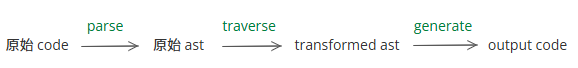

## What is Babel

Babel 是 javascript **compiler**，但和通常说的 compiler 有些不同。通常说的 compiler 是将某种编程语言的 source code 转换成 machine code，转换遵循此种编程语言的语法。但 Babel 输入和输出的都是 js 代码，而且它的转换规则是你制定的。如果你没有设置规则，那 Babel 会原样输出（会做一些格式化处理，比如行尾添加分号）

在项目中常用 babel 处理浏览器兼容问题，但这只是 babel 的功能之一。babel 还能做很多事情，比如：

按需引用：

```js
import _ from "lodash";
_.map();
// =>
import { _map } from "lodash/map";
_map();
```

path alias：

```js
import "@/test.js";
// =>
import "src/test.js";
```

minify：

```js
function functionThatHasVeryLongName() {}
functionThatHasVeryLongName();
// =>
function c() {}
c();
```

eslint prettier 等工具也是使用 babel 实现的，比如：

```js
import { foo } from "./bar";
// => 提示找不到 ./bar
```

## Babel 原理



parse、traverse、generate 分别由 `@babel/parser`、`@babel/traverse`、`@babel/generator` 提供。

babel 默认遵守 ECMAScript 最新语法，支持 jsx flow typescript，支持稳定的 experimental language proposals。

在使用 babel 的时候，parse 和 generate 都由 babel 处理（只能传一些 options 去控制是否开启某些语法、对输出内容进行格式化等）。我们主要是在 traverse 阶段**操纵 ast 对象**。

> AST: An abstract syntax tree (AST) is a data structure used in computer science to represent the structure of a program or code snippet.

babel 提供一些官方插件：以 `@babel/`开头，比如：

- @babel/plugin-transform-transform-classes(ECMAScript features)
- @babel/plugin-proposal-optional-chaining(ECMAScript proposals)
- @babel/plugin-transform-typescript (typescript)
- @babel/plugin-transform-react-jsx (jsx)
- @babel/plugin-transform-runtime(Optimization)

babel 社区插件以`babel-plugin-` 开头。

## 使用 Babel

如前所述，使用 babel 时 code 和 ast 之间的转换完全不需要我们操心（想操心也做不到），我们只需要关注 traverse 阶段如何操纵 ast 对象。

所以最重要的是熟悉 ast node 和 traverse 阶段 path 的各种方法。但这比较困难，因为 ast 和 path 的 API 非常丰富，而且 path 的 API 没有一份具体的文档（handbook 只介绍了最常用的），只能自己多熟悉多积累。

- [babel plugin handbook](https://github.com/jamiebuilds/babel-handbook/blob/master/translations/zh-Hans/plugin-handbook.md)
- [ast explorer](https://astexplorer.net/)
- [ast node types doc](https://github.com/babel/babel/blob/main/packages/babel-parser/ast/spec.md)
- [《babel 插件编写》](https://hoperyy.github.io/deep-in-babel/06.Babel%E6%8F%92%E4%BB%B6%E7%BC%96%E5%86%99/)

在实际使用 babel 插件时，最困难是要考虑全面，比如我想要将 `?.` 转为旧浏览器也可以识别的语法：`a?.b` -> `a===undefined?undefined:a.b`，看上去很简单。但是转换时不能只考虑 `a?.b` 这种简单的情况，还需要考虑各种用法 `a?.b.c?.d`、`a()?.b` 等。

使用 babel 有多种方式，下面依次介绍：

- 直接使用 parse + traverse + generate
- 使用 @babel/core
- 使用 @babel/cli

### parse + traverse + generate

项目中可以直接使用 babel 提供的 parse、traverse、generate 方法（`@babel/parser` `@babel/traverse` `@babel/generator` 等库）

注意：使用 es modules 的项目在使用 `@babel/traverse` 时不能直接按照官网的示例代码写，需要把 `traverse(ast,{...})` 改成 `traverse.default(ast,{...})`，详情见 [issue - TypeError: traverse is not a function](https://github.com/babel/babel/discussions/13093)

#### 例: 移除 debugger

debugger 是 [DebuggerStatement](https://github.com/babel/babel/blob/main/packages/babel-parser/ast/spec.md#debuggerstatement)

```js
import { parse } from "@babel/parser";
import traverse from "@babel/traverse";
import generate from "@babel/generator";

export function removeDebugger(code) {
  const ast = parse(code);

  traverse.default(ast, {
    DebuggerStatement(path) {
      path.remove();
    },
  });
  return generate.default(ast).code;
}
```

测试效果：

```js
const code = `const name = 'emily';debugger;var str='debugger';`;
console.log(removeDebugger(code));
```

输出

```js
const name = "emily";
var str = "debugger";
```

（文章[《编写 vite 插件移除 vue SFC 中的 debugger》](post:26fd7f0c-3760-40d6-95e6-c7cf8db699b8)中就使用了这里的 removeDebugger）

#### 例: 移除 console.log

这个例子比移除 debugger 要复杂一些，因为 `console.log()` 在 babel ast 中没有"专属"类型，所以需要自己判断。

在 [ast explorer](https://astexplorer.net/) 中查看：`console.log()` 是一个 [CallExpression](https://github.com/babel/babel/blob/main/packages/babel-parser/ast/spec.md#callexpression)，这个 callExpression 的 callee `console.log` 是一个 [MemberExpression](https://github.com/babel/babel/blob/main/packages/babel-parser/ast/spec.md#memberexpression) (`a.b`或`a[b]`)，这个 memberExpression 的 `object` 是一个 name 为 `console` 的 Identifier，`property` 是一个 name 为 `log` 的 Identifier，

```js
import generate from "@babel/generator";
import { parse } from "@babel/parser";
import traverse from "@babel/traverse";
import t from "@babel/types";

export function removeLog(code) {
  const ast = parse(code);

  traverse.default(ast, {
    CallExpression(path) {
      const { callee } = path.node;
      if (!t.isMemberExpression(callee)) {
        return;
      }
      const { object, property } = callee;
      if (
        !(t.isIdentifier(object, { name: "console" }) && t.isIdentifier(property, { name: "log" }))
      ) {
        return;
      }
      path.remove();
    },
  });
  return generate.default(ast).code;
}
```

测试效果：

```js
const code = `const name = 'emily';console.log(name)`;
console.log(removeLog(code));
```

输出

```js
const name = "emily";
```

注：上面的代码并不完善，只能移除 `console.log()` 这种调用方式。下面两种写法实际都是调用 console.log 但无法移除：（我现在对 ast 和 path 的 api 还很不熟悉，所以虽然想到了这些情况，但不知道怎么处理。。。）

```js
const { log } = console;
log("hi");
```

```js
const foo = console.log;
foo("hi");
```

### @babel/core

项目可以直接使用 @babel/core，它集成了 babel 所有核心库（见 [dependencies 字段](https://github.com/babel/babel/blob/main/packages/babel-core/package.json)）。@babel/core 会读取项目中的 babel 配置文件，所以你的转换规则都要写在配置文件里。

使用 @babel/core 时可用使用 presets 和 plugins。

还拿上面的 removeDebugger 举例，介绍如何在结合 @babel/core 使用。

创建 babel.config.json:

```json
{
  "plugins": ["./my-plugin-remove-debbuger.js"]
}
```

创建 my-plugin-remove-debbuger.js:

```js
export default function () {
  return {
    visitor: {
      DebuggerStatement(path) {
        path.remove();
      },
    },
  };
}
```

index.js

```js
import * as babel from "@babel/core";

const code = `const name = 'emily';debugger`;

babel.transformAsync(code, {}).then((res) => {
  console.log(res.code);
});
```

测试效果，运行 `node index.js`

输出:

```js
const name = "emily";
```

### @babel/cli

babel 可以应用于多种开发环境中，为了适应，babel 将核心功能都放在 @babel/core 中。对不同开发环境，又分别提供了包：

- @babel/cli: 在 terminal 中使用 babel
- @babel/standalone: 在浏览器等非 nodejs 环境使用 babel
- @babel/register: 实时转换代码（适用于没有构建步骤的项目。利用 nodejs 的 require hook，实时转换 require 的文件代码）

只介绍 @babel/cli 的用法。

安装 @babel/cli 后，添加 script：

```json
"scripts": {
  "my-compile": "babel src --out-dir dist"
}
```

运行 `npm run my-compile`，会将 src 中的所有文件转换后放到 dist 文件中（配置文件、插件写法等和 @babel/core 完全一致，因为核心功能就是 `@babel/core`，`@babel-cli` 只是额外提供了 terminal 支持）。

### 总结

如果你的项目需要集成 babel（ polyfill、转换 jsx 等）功能，一般直接用 @babel/cli。

如果是项目中某个子功能需要转换代码，用 `parse + traverse + generate`

很少直接用 `@babel/core`（因为如果你采用了配置文件的形式，说明你是打算整个项目的代码都要处理，那可以直接用 @babel/cli。如果只是局部想使用，用配置文件的形式会很奇怪）

## 常用方法

辅助库：

- `@babel/types`：方便的创建、检查 ast node
- `@babel/template`（不确定怎么用，以后有空试试）

记录一下自己用到的方法：

```js
// 如果在转换的过程中需要创建一个局部变量
const tmp = path.scope.generateUidIdentifier("somename");
path.scope.push({ id: tmp });
```

```js
path.scope.rename(oldName, newName);
path.scope.hasBinding(name);
```

```js
const newNode = t.identifier("hello");
path.replaceWith(newNode);
path.skip(); // 跳过当前生成的（避免无限循环）
path.stop(); // 跳过当前 path 的 siblings
```
