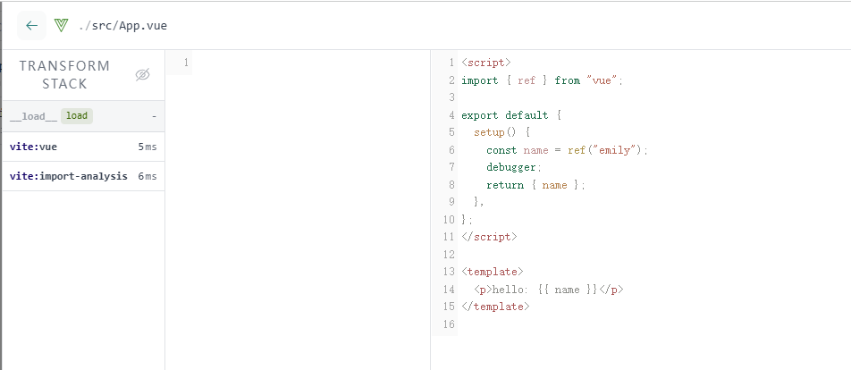
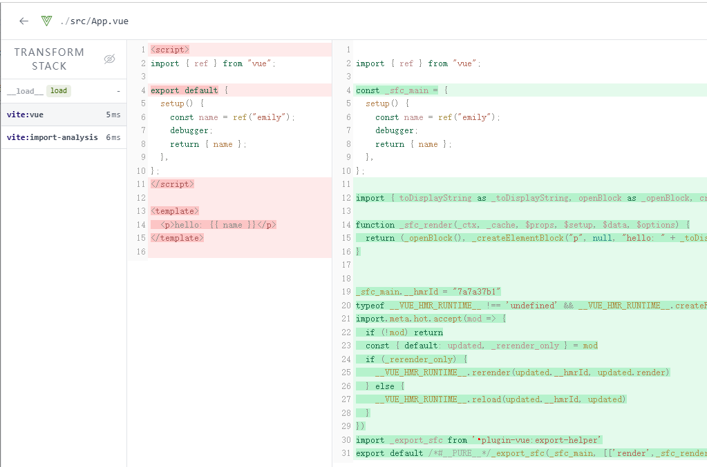
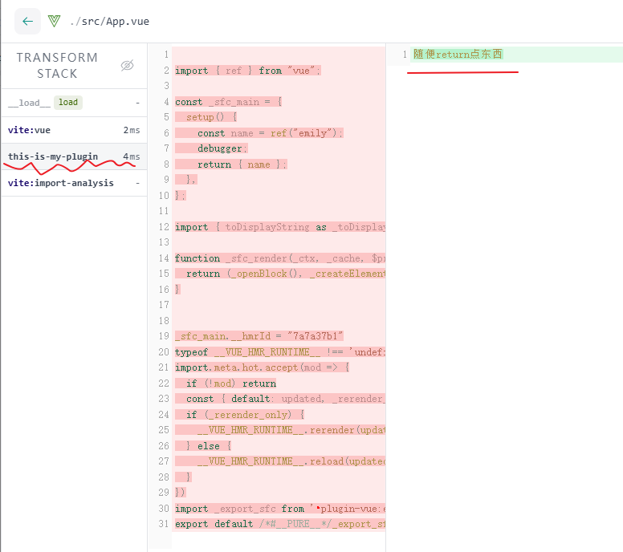
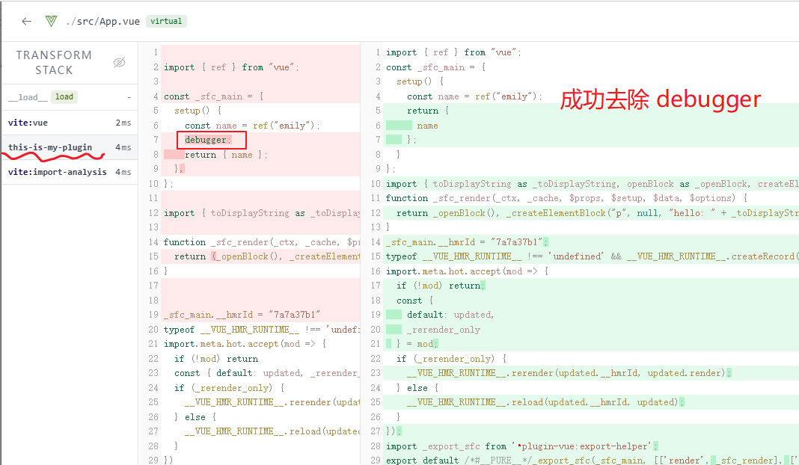
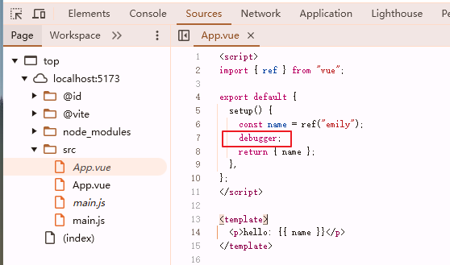

本文以一个具体示例，介绍如何编写 vite 插件以及 babel 的实际应用

## 需求

创建 vite 项目 `pnpm create vite --template vue`。

简化项目内容：入口文件 main.js 中只引用 App.vue，App.vue 的内容简化为：

```html
<script>
  import { ref } from "vue";

  export default {
    setup() {
      const name = ref("emily");
      debugger;
      return { name };
    },
  };
</script>

<template>
  <p>hello: {{ name }}</p>
</template>
```

需求：将 App.vue 中的 debugger 语句去掉。

## 实现

### 创建 vite 插件

首先要知道如何创建 vite 插件，查看[文档](https://cn.vitejs.dev/guide/api-plugin.html)。

vite 插件在 rollup 插件格式的基础上，拓展了一些 vite 特有的配置项。所以在编写 vite 插件时需要先了解 rollup 插件。

vite 为插件开发者提供 [vite-plugin-inspect](https://github.com/antfu-collective/vite-plugin-inspect) 插件，帮助检查插件的中间状态（亲测非常有帮助，强烈推荐）。

在 vite.config.js 中添加 inspect 和 myPlugin:

```js
import { defineConfig } from "vite";
import vue from "@vitejs/plugin-vue";
import Inspect from "vite-plugin-inspect";

export default defineConfig({
  plugins: [Inspect(), vue(), myPlugin()],
});

function myPlugin() {
  return {
    name: "this-is-my-plugin",
    transform(code, id) {
      debugger;
    },
  };
}
```

测试插件是否生效：启动项目。但是项目成功启动后，并没有进入 myPlugin 的 debugger，inspect 页面也没有显示文件。好像不只是 myPlugin 没生效，其它的 vite 插件也都没生效，怎么回事？

—— 这是因为 dev 时 vite 是按需加载，需要在浏览器中访问页面才会加载相关内容，才会触发 plugin。

在浏览器中访问页面，成功进入 myPlugin 的 debugger，inspect 页面也正常显示出内容了。

### 定位要修改的内容

下一步是定位我们想要修改的内容：即 vue SFC 文件

在 inspect 页面中查看 App.vue 文件被插件处理的过程：

首先是 load：



然后是 vue 插件将 vue SFC 解析为 js：



此时 inspect 中没有显示 myPlugin，因为 myPlugin 没有修改内容，所以不显示。

我打算用 babel 实现移除 debugger，所以需要获取 js 代码，那么应该在 vue 插件将 vue SFC 转换为 js 后再处理。所以 plugins 的顺序很重要：

```js
  plugins: [vue(), myPlugin()], // 正确！myPlugin 中拿到的是 js
  plugins: [myPlugin(), vue()], // 错误！myPlugin 中拿到的是 SFC 源码，babel 无法处理

```

现在给 myPlugin 随便添加点返回值：

```js
function myPlugin() {
  return {
    name: "this-is-my-plugin",
    transform(code, id) {
      if (!id.endsWith(".vue")) {
        return;
      }
      return "随便return点东西";
    },
  };
}
```

inspect 中显示：（页面会报错，因为这不是一个 vue 组件。不用管它）



### 使用 babel 实现移除 debugger

项目中 babel 有多种使用方式，我采用 parse + traverse + generate 的方式（更多 babel 内容见 [《babel 原理及用法》](post:ecc21717-d953-412c-b5e0-1d5c369a58d2)。

```js
import vue from "@vitejs/plugin-vue";
import { defineConfig } from "vite";
import Inspect from "vite-plugin-inspect";

export default defineConfig({
  plugins: [Inspect(), vue(), myPlugin()],
});

function myPlugin() {
  return {
    name: "this-is-my-plugin",
    transform(code, id) {
      if (!id.endsWith(".vue")) {
        return;
      }
      return removeDebugger(code);
    },
  };
}

import { parse } from "@babel/parser";
import traverse from "@babel/traverse";
import generate from "@babel/generator";
function removeDebugger(code) {
  const ast = parse(code, { sourceType: "module" });

  traverse.default(ast, {
    DebuggerStatement(path) {
      path.remove();
    },
  });
  return generate.default(ast).code;
}
```

inspect 中查看：



浏览器访问页面时，不会进入 debugger，说明确实生效了。

注意：浏览器开发者工具 - Sources 中看到的是源码，源码里有 debugger，但其实已经被去掉了：



（本文代码只是一个 demo，没有考虑边界情况、与其他插件功能使用的效果，不能放到实际项目中使用）
