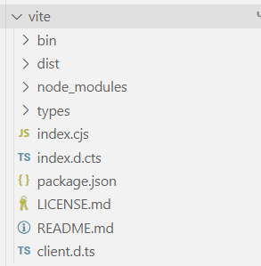
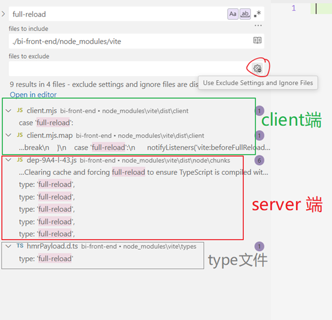
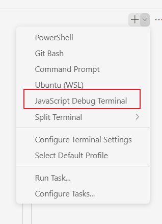

## 问题描述

工作项目使用 vite，dev 时 hmr 出问题了：修改文件内容总是导致页面 full-reload，即使是很微小的变化也 full-reload。我们的项目 load 很费时间，所以开发体验极糟。

发现这个问题时我就想解决。我研究了一会儿，发现浏览器（dev client）接受到 node 服务器（dev server）发来的 websocket 信息 `full-reload`，但是这之后该怎么排查我就没头绪了。所以当时我放弃，妥协了，开发时都是盲写。

但是后来开发的功能有很复杂的 UI 样式。之前多是逻辑部分，我可以盲写。但是样式不可能盲写，我改一下样式代码就要重新加载两分钟，再改一下再加载两分钟。。。总未有过这么糟糕的开发体验，我忍无可忍，决定无论如何也要 fix 这个问题。

## 解决过程

###### 首先判断项目的 hmr 是否全面坏掉了

- 如果项目的 hmr 全面坏掉了，则很可能是项目的配置哪里出错了（或者是 vite 本身出 bug，但这种几率很小）
- 如果 hmr 没有全面坏掉，那么说明是我们自己写的代码有问题。

我修改根组件 App.vue 的内容，发现 hmr 正常。然后我顺着 App.vue 到出问题的文件的 import chain 一路试，发现确实是到某一层才开始 full-reload。

这表示问题大概率出在我们自己的代码上。

###### 查看 vite 官方文档看有没有 hmr 相关信息

我找到了 [HMR API](https://cn.vite.dev/guide/api-hmr)，它里面说可以监听 HMR 事件，其中的 beforeFullReload 应该就是我需要的：

```js
if (import.meta.hot) {
  import.meta.hot.on("vite:beforeFullReload", (payload) => {
    debugger;
  });
}
```

但文档里没有说这段代码要写在哪里。我尝试写在 `src/main.js` 和 `src/App.vue` 里，但都无效。很茫然，后来在网上偶然查到是写在 index.html 里。。。

```html
<script type="module">
  if (import.meta.hot) {
    import.meta.hot.on("vite:beforeFullReload", (payload) => {
      debugger;
    });
  }
</script>
```

触发 bug，确实进入了这个 hook，但是 payload 的内容只有 `{type:'full-reload'}`，没有更多的信息了。所以还要找别的办法，继续看 vite 文档。

我发现 vite 启动时可以传递参数 [-d](https://cn.vite.dev/guide/cli.html#options) 显示调试信息。我使用 `-d` 后，发现 node 控制台确实输出了额外信息。

我触发 bug，node 控制台输出了海量的内容，这是因为页面 reload 后 node 控制台显示了所有加载的文件。所以即使在这之前有关于 hmr 的调试信息，现在也被海量加载信息淹没了。

这时候我想到，可以和上面的 hook 结合使用：我触发 bug，node 控制台先打印 hmr 的调试信息（如果有的话），这时候浏览器中会进入 `vite:beforeFullReload` 的 debugger，只要我不放行断点就不会 reload 页面，这样 node 端的控制台就不会被加载文件的信息淹没。我按照这个方法实践了一下，果然成功！

node 控制台输出 hmr 调试信息：

```bash
vite:hmr [file change] xxx.js
vite:hmr circular imports detected: xxx.js ->....-> xxx.js
[vite] page reload xxx.js
```

根据以上信息，vite hmr 检测到了 circular imports，在 [vite trouble shooting](https://cn.vite.dev/guide/troubleshooting.html#hmr) 中也有相关信息：（我是在解决完问题后才看到文档中的这段内容，可恶，如果我早看到可能就不用自己费劲看源码了。。。）

> If HMR is handled but it is within a circular dependency, a full reload will also happen to recover the execution order. To solve this, try breaking the loop. You can run vite --debug hmr to log the circular dependency path if a file change triggered it.

###### 查看 vite server 端的代码

上面说的 "浏览器中 debugger hook" 和 "`vite -d`" 结合使用查看 hmr 调试信息其实是我最后才想到的。所以在我解决这个 bug 的过程中，是没有看到 `vite:hmr circular imports detected` 这个信息，也没有看到 vite 文档中的[这段](https://cn.vite.dev/guide/troubleshooting.html#hmr)。我当时只进展到：client 端（浏览器）只能接受到信息 `{type:'full-reload'}`，至于为什么要 reload 在 client 是无法知道的，要知道只能去 server 端查看。

所以我去看 server 端了 —— 项目中 vite 的代码在 `node_modules/vite` 中：



在此目录下搜索 "full-reload"（搜索时一定要把 "Use Exclude Settings and Ignore Files" 取消）



从搜索结果的文件名称中可以推断出，server 端代码应该是 `vite/dist/node/chunks/dep-xxx.js` 这个文件。这个文件中匹配到了多处，查看后发现都是 `ws.send({ type: "full-reload" })`，都有嫌疑，所以干脆都打上断点。在 vscode 中用 debugger 模式启动项目：



触发 bug，果然进入了 `dep-xxx.js` 其中一个断点！Gotcha！

接下来就到了熟悉的步骤了：看调用栈+研究源码 —— 过程不细说了，最终发现有两种情况会导致 hmr full-reload：循环依赖 或者 dead end。而我们项目是因为循环引用才 full-reload。

我修改项目代码，打破循环引用后果然 hmr 就正常工作了！

## 一些思考

在复杂项目中，循环依赖其实是很常见的。理论上当然是可以设计出没有循环依赖的代码，但实际中变数太多，很难实现。

vite 一遇到循环依赖，hmr 就会彻底失效，这其实是蛮严重的体验问题。尤其是 vite 的所有资源都是按需加载，每次 full-reload 耗时极长。这与使用 vite 的初衷完全背道而驰了。

附上一些相关 issues 吧：

- [How do you guys handle circular imports? ](https://github.com/vitejs/vite/discussions/16424)
- [Circular imports in HMR](https://github.com/vitejs/vite/issues/16580)
