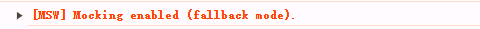

## 概述

项目中需要添加模拟请求的功能，本打算使用 mockjs，但查阅后发现它已经九年没更新了，所以打算换一个仍在维护的库。

一番检索后，决定使用 [fakerjs](https://github.com/faker-js/faker) + [msw](https://github.com/mswjs/msw) 的组合：fakerjs 模拟数据，msw 拦截接口。

###### msw 与 mockjs 的区别

重点说一下 msw 与 mockjs 拦截方式的不同：

- mockjs 覆盖原生的 XMLHttpRequest 对象，拦截的请求不会真正发送
- msw 是基于 service worker 在**网络层**拦截请求

以前我用过 mockjs，它无法直观地查看请求参数和 header，很麻烦。
而用 msw 时，你可以在 F12 - Network 中看到请求，so 方便！

###### service worker 的限制

service worker 必须在**安全**的网络环境中使用，即 `https` / `localhost` / `127.0.0.1`。

所以要用 msw 的 service worker，也必须是这三者之一。如果你用 `http://ip` 访问应用，msw 会 fallback 到和 mockjs 一样的策略，此时你就不能在 F12 - Network 中看到请求了。

## 实战

我们的项目在开发阶段必须用 ip 访问（这是后端的要求，理由是后端某些代码要求获取真实 ip，我也不太明白为什么，反正就是这样要求了）。所以我们本地启动项目用都要用`vite --host`，然后在浏览器中用 ip 访问。

当我在项目中配置好 msw 后，启动项目，msw 生效但是为 `fallback mode`：



fallback mode 可以拦截请求，但是拦截效果和 mockjs 相同，无法在 F12 - Network 中看到被拦截的请求。

我觉得这样用着不方便，所以决定改造 —— 将我们本地开发环境改为 `https`！

使用 [vite-plugin-mkcert](https://github.com/liuweiGL/vite-plugin-mkcert) 插件。

安装：

```
pnpm i vite-plugin-mkcert -D
```

配置：

```js
// vite.config.js
import { defineConfig } from "vite";
import mkcert from "vite-plugin-mkcert";

export default defineConfig({
  server: {
    https: true,
  },
  plugins: [
    mkcert({
      source: "coding", //指定 mkcert 的下载源，国内用户可以设置成 coding 从 coding.net 镜像下载
    }),
  ],
});
```

插件会判断你操作系统的类型，然后从网络下载对应的 mkcert 版本，存放在你的电脑上。如插件的文档所写，下载的资源默认存放地址是 PLUGIN_DATA_DIR，查看源代码得知这个变量的值是：

```js
// vite-plugin-mkcert/plugin/lib/constant.ts
export const PLUGIN_DATA_DIR = path.join(os.homedir(), `.${PKG_NAME}`);
```

所以资源不是放在项目内部，而是放在电脑个人文件夹下（我的电脑是在`C:\Users\[我的用户名]\.vite-plugin-mkcert`中）。你也可以设置 savePath 修改此路径。

默认的下载源是 github（我看源码得知的），国内用户基本会被墙，可以设置 `source:coding`，它指向一个国内镜像地址。或者可以指定 `mkcertPath` 要求使用本地资源。
PS：使用本地资源时要注意，如果是团队项目，最好不要将这个资源放在项目内且 git 它，因为团队成员的电脑配置可能不同，你是 windows，它是 linux。不能共用 mkcert。

更多配置项请看[文档](https://github.com/liuweiGL/vite-plugin-mkcert?tab=readme-ov-file#parameters)。

###### worker.start() 是异步的

我在写 demo 时发现个新问题：`worker.start()` 是异步操作。

demo 的代码如下：

```js
// mock.js
const worker = setupWorker(...handlers);
worker.start();

// main.js
import "./mock.js";
createApp(App).mount("#app");

// App.vue 的 script
import axios from "axios";
axios
  .get("/api/hello")
  .then(function (response) {
    // handle success
    console.log(response);
  })
</script>
```

可以看出我是先启动 msw，然后挂载应用。但是请求并没有成功拦截！因为 msw worker 的启动是异步的！

我在工作项目中没有发现这个问题，因为那个项目很大，加载页面需要很久很久很久，所以 msw 的 worker 先完成初始化了。但是 demo 的页面非常简单，所以它更快，请求先发出去了，然后 worker 才启动成功。

需要修改一下：

```js
// mock.js
export const worker = setupWorker(...handlers);

// main.js
import { worker } from "./mock";

async function bootstrap() {
  await worker.start(); // 等待 worker 启动完成
  createApp(App).mount("#app"); // 启动 Vue 应用
}

bootstrap();
```

---

我写了一个 vite 项目使用 https + msw 的 demo，见[仓库源码](https://github.com/liuzx-emily/demo-vite-https-msw)
