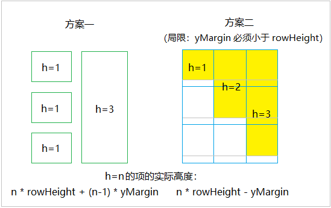
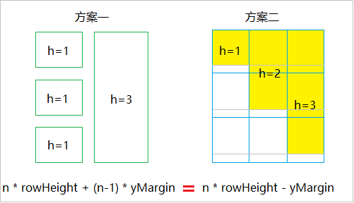
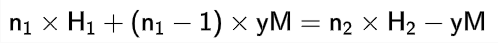
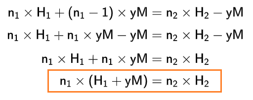

## 网格布局的两种策略

对于带有“间隙（Margin）”的网格布局，通常有两种对齐策略。这两者没有绝对的优劣，主要取决于业务需求：

- **方案一**：当 `yMargin` 变化时，项的高度会产生剧烈的视觉缩放。
- **方案二**：`yMargin` 对项的高度不会产生剧烈影响。但有一个限制：`yMargin` 必须小于 `rowHeight`。

目前市面上主流的实现（如 vue-grid-layout）以及原生的 CSS Grid，基本都采用了方案一。

由于我们的项目支持用户自定义**页面内边距**和**组件间隙**，且不希望用户在调整间隙时，组件高度发生“骤变”。经过评估，方案二的限制在业务中完全可以接受，因此我选择了**方案二**。

## 如何完美转换老数据

确定了方案，下一步需要考虑如何处理老数据：我们项目之前使用 vue-grid-layout 组件，用户以前创建的布局数据（方案一），如何完美对应到新布局（方案二）中？

起初我一直在“硬想”转换逻辑，总觉得两种底层逻辑不同的方案很难完美兼容。后来灵机一动，决定用数学公式推导一下。目标很简单，就是要让两套方案下计算出的**项的实际高度（px）**相等：

设老数据项的高为 `n1`，行高为 `H1`。新的布局组件中，项的高为 `n2`，行高为 `H2`。转换时 yMargin 保持不变，记为 `yM`。

代入两套方案的高度公式：

经过一番基础变换：

结论：只要设置新行高 `H2 = H1 + yM`，就能保证在不改动项的高度数值（即 `n1` = `n2`）的情况下，实现视觉上的完美转换。这省去了清洗旧数据的麻烦。

## 核心思路概述

### grid 坐标和 px 坐标

为了实现“网格系统”与“交互顺滑”的效果，需要两套坐标系统：

- grid 坐标：以格子为单位。用于存储静止状态下的项，是数据的核心。

- px 坐标：用于交互时的临时状态。因为 grid 坐标是间断变化的，只有引入 pX 坐标，才能在拖拽或缩放时提供连续、丝滑的手感。

### 引入 placeholder

dragging 或 resizing 时，因为项使用 px 坐标，所以会脱离网格系统的“束缚”。引入 placeholder，它作为一个直观的提示，让用户清楚地看到：如果此时松手，项在网格框架里会**回归**到什么位置和大小。

### 项的样式

在不同的交互阶段，项的“位置”和“尺寸”会根据需要动态挂载到不同的坐标系上：

- **静止状态**：位置与尺寸均由 **Grid 坐标** 驱动，严格对齐网格。
- **拖拽中 (Dragging)**：位置切换为 **px 坐标** 以实现随手移动的丝滑感；尺寸仍锁定为 **Grid 坐标**。
- **缩放中 (Resizing)**：位置锁定为 **Grid 坐标**；尺寸切换为 **px 坐标**，让拉伸更实时。

### 为什么在后期弃用 CSS Grid？

对于静止状态下使用的 grid 坐标，我一开始使用 `CSS Grid`：它原生的 gap 是采用方案一，所以我是把这个原生 gap 设置为 0，自己在每个格子内设置 margin-bottom 去模拟 y margin。

但是在最后阶段放弃使用 CSS Grid，改用 `absolute` 定位。原因如下：

- **动画缺失（致命伤）**：CSS Grid 不支持 transition。所以在拖拽、缩放项时，视觉反馈会非常突兀。
- **布局限制**：作为严格的网格布局，CSS Grid 无法像绝对定位那样真实地去掉组件的 `margin-bottom`。所以最下方组件的下面和外层容器之间有一个去不掉的 margin-bottom。
- **计算量并没减少**：虽然 CSS Grid 能处理部分布局，但在处理双坐标转换和推挤逻辑时，该写的计算逻辑依然少不了，并没有降低开发成本。

根本原因是第一点。 表面上看“没有动画”只是视觉效果打点折扣。但在实际开发这种强交互库时，最难调试、也最要命的就是手感与视觉反馈。

在开发和调试的过程中，我注意到在某些边界情况下，项的移动显得异常突兀。我一度怀疑是代码哪里写错了，陷入了大量的调试工作，反复检查逻辑边界，最后才猛然意识到：逻辑本身是正确的，只是因为没有动画过渡，导致那种视觉上的“瞬移”看起来极其不合理。

当我彻底换成 absolute 定位并配合简单的 transition 之后，那种突兀感瞬间消失，整个交互逻辑瞬间“顺”了，一切都美好了起来。

### 交互逻辑（以 Drag 为例）

- **Dragstart**：
  - 项改为使用 px 坐标
  - 用项当前的 grid 坐标计算出对应的 px 坐标作为起始位置（存在临时状态中）
  - 显示 placeholder
- **Dragging**：
  - 计算鼠标位移（Delta）
  - 更新项的 **px 坐标**
  - 反向计算出 **Grid 坐标**并触发 `move()` 推挤逻辑
  - 实时移动 placeholder。
- **Dragend**
  - 清空临时状态
  - 项回归 Grid 坐标
  - 隐藏 placeholder。

（这部分还是看代码比较好理解）
